# Architecture & Concepts

This handbook serves as a comprehensive guide to the architectural choices, design patterns, and technology stack for this FusionAuth implementation in Bun.

---

## Table of Contents

1. [Overview](#1-overview)
2. [Project Structure](#2-project-structure)
3. [Clean Architecture Principles](#3-clean-architecture-principles)
4. [The Four Layers Explained](#4-the-four-layers-explained)
5. [Deep Dive: Ports & Adapters](#5-deep-dive-ports--adapters)
6. [Cross-Cutting Concerns](#6-cross-cutting-concerns)
7. [Dependency Injection](#7-dependency-injection)
8. [Complete Example: User Registration](#8-complete-example-user-registration)
9. [Testing Strategy](#9-testing-strategy)
10. [Technology Stack](#10-technology-stack)
11. [Advanced Patterns & Best Practices](#11-advanced-patterns--best-practices)
---

## 1. Overview

This project uses **Feature-First Clean Architecture**, which means:

- **Feature-First**: Code is organized by business features (e.g., `auth`, `users`, `tenants`) rather than technical layers (e.g., `controllers`, `services`, `models`)
- **Clean Architecture**: Each feature follows the layered architecture pattern with strict dependency rules

### Why Feature-First?

**Traditional Approach (Layer-First):**
```
src/
├── controllers/      # All controllers from all features
│   ├── AuthController.ts
│   ├── UserController.ts
│   └── TenantController.ts
├── services/         # All services from all features
│   ├── AuthService.ts
│   ├── UserService.ts
│   └── TenantService.ts
└── repositories/     # All repositories from all features
    ├── UserRepository.ts
    └── TenantRepository.ts
```

**Problems:**
- Hard to find related code (authentication logic scattered across 3+ folders)
- Difficult to understand what features exist
- Large folders as the project grows

**Feature-First Approach:**
```
src/
└── features/
    ├── auth/         # Everything related to authentication
    │   ├── presentation/
    │   ├── application/
    │   ├── infrastructure/
    │   └── domain/
    ├── users/        # Everything related to users
    │   ├── presentation/
    │   ├── application/
    │   ├── infrastructure/
    │   └── domain/
    └── tenants/      # Everything related to multi-tenancy
        ├── presentation/
        ├── application/
        ├── infrastructure/
        └── domain/
```

**Benefits:**
- **Scalability**: Each feature is self-contained
- **Maintainability**: Need to fix login? Go to `src/features/auth`
- **Team Collaboration**: Different teams can work on different features
- **Understanding**: The folder structure tells you what the app does

---

## 2. Project Structure

```
auth-bun/
  src/
    main.ts                      # Process entry (Bun/Node runs this)
    bootstrap/                   # Composition root / app wiring
      index.ts                   # Exports createApp
      app.ts                     # Main Elysia app (wires features)

    shared/                      # Shared Kernel & Cross-cutting concerns
      kernel/                    # Domain Layer (Pure, no dependencies)
        types/                   # Result, Brand, Primitives
        errors/                  # AppError
        rules/                   # Global validation rules
      
      application/               # Application Layer (Interfaces)
        interfaces/              # ILogger, IEventBus, IIdGenerator
        dtos/                    # Shared DTOs (e.g. Paging)

      infrastructure/            # Infrastructure Layer (Implementations)
        database/                # Drizzle instance, migrations
        logging/                 # ConsoleLogger
        ids/                     # Cuid2Generator
        config/                  # App configuration
        utils/                   # DateUtils, etc.

      presentation/              # Presentation Layer (HTTP Adapters)
        middleware/              # ErrorHandler, RequestLogger
        http-client/             # Shared HTTP client wrappers

    features/
      auth/
        domain/                  # Business rules (no framework, no DB)
          entities/
            User.ts
            Token.ts
          values/
            Email.ts
            Password.ts
          rules/
            passwordRules.ts
          services/              # domain services
            UserDomainService.ts
          events/                # domain events
            UserRegisteredEvent.ts

        application/             # Use-case orchestration, ports, DTOs
          ports/                 # Interfaces used by use-cases
            IUserRepository.ts
            ITokenRepository.ts
            IEmailService.ts
            ITokenService.ts
            IPasswordHasher.ts
          dtos/                  # Use-case I/O models (framework-agnostic)
            RegisterUserInput.ts
            RegisterUserOutput.ts
            LoginUserInput.ts
            LoginUserOutput.ts
          usecases/
            RegisterUser.ts
            LoginUser.ts
            VerifyEmail.ts
            ForgotPassword.ts
            ResetPassword.ts

        infrastructure/          # Implements ports using concrete tech
          schema/
            users.ts
            tokens.ts
          mappers/
            UserMapper.ts
          repositories/
            DrizzleUserRepository.ts
            DrizzleTokenRepository.ts
          services/
            EmailService.ts
            JwtTokenService.ts
            BunPasswordHasher.ts

        presentation/            # Transport-specific adapters (HTTP/Elysia)
          http/
            dtos/                # Transport DTOs
              RegisterRequestDto.ts
              LoginRequestDto.ts
              UserResponseDto.ts
              LoginResponseDto.ts
              ErrorResponseDto.ts
            mappers/
              AuthMappers.ts     # Map transport DTO ↔ use-case DTO / domain
            middleware/          # Feature-specific middleware (e.g. Auth)
              authMiddleware.ts
            AuthController.ts    # Route handlers (calls use-cases)
        
        ioc.ts                   # Feature Plugin (DI & Wiring)

      users/
        domain/
        application/
        infrastructure/
        presentation/

      tenants/
        domain/
        application/
        infrastructure/
        presentation/

  tests/
    auth/
      RegisterUser.test.ts
      LoginUser.test.ts
    users/

  migrations/
    0001_initial.sql
    0002_add_email_verification.sql

  docker-compose.yml
  Dockerfile
  package.json
  tsconfig.json
  README.md
```
### Key Directories Explained

**`src/shared/`**: Shared Kernel & Cross-Cutting Concerns
- **`kernel/`**: The "Shared Kernel". Contains pure domain logic shared across features (e.g., `Result`, `AppError`, `UserId`). Zero dependencies.
- **`application/`**: Shared interfaces and DTOs (e.g., `ILogger`, `IIdGenerator`).
- **`infrastructure/`**: Shared implementations (e.g., `Drizzle`, `ConsoleLogger`, `Config`).
- **`presentation/`**: Shared HTTP adapters (e.g., `ErrorHandler`).
- **Rules**:
    - ✅ Can be imported by any feature (respecting layers).
    - ❌ Cannot import from any feature.

**`src/features/{feature}/domain/`**: Core business model
- Zero dependencies on frameworks or external libraries
- Entities, interfaces, business rules
- Most stable layer (changes least)

**`src/features/{feature}/application/`**: Application logic
- Depends only on domain
- Use cases orchestrate operations
- **Use-case DTOs**: Framework-agnostic input/output models
- Where the application's capabilities are defined

**`src/features/{feature}/infrastructure/`**: Infrastructure implementations
- Database access (Drizzle ORM)
- External API clients
- Service implementations (password hashing, email, tokens)
- Implements Application interfaces (Ports)

**`src/features/{feature}/presentation/`**: Presentation Layer
- Grouped by transport (e.g., `http/`, `rpc/`, `graphql/`)
- **`http/`**:
    - **Controllers**: Handle HTTP requests
    - **Routes**: Register endpoints (`routes.ts`)
    - **Transport DTOs**: HTTP request/response shapes
    - **Mappers**: Transform Transport DTOs ↔ Use-case DTOs

**`src/features/{feature}/ioc.ts`**: Feature Module
- The "Composition Root" for this feature (entry point)
- Registers dependencies (Repositories, Use Cases)
- Exports an Elysia plugin (`authModule`)

**`src/main.ts`**: Process Entry Point
- **The "Dirty" Entry Point**: This is the file you actually run (e.g., `bun run src/main.ts`).
- **Responsibilities**:
    - Reads environment variables (PORT, HOST)
    - Calls `createApp()` from bootstrap
    - Starts the HTTP server (binds to port)
    - Handles process signals (SIGTERM, SIGINT) for graceful shutdown

**`src/bootstrap/`**: Application Composition Root
- **The "Clean" Factory**: This directory contains the logic to *build* the application instance without running it. This separation is crucial for testing (so we can create an app instance for tests without binding to a real network port).
- **`app.ts` (The Blueprint)**:
    - Defines the Elysia app instance
    - Registers global middleware (CORS, Logger, Swagger)
    - Wires up all Feature Modules (`.use(authModule)`)
    - Defines global error handlers
- **`index.ts` (The Factory)**:
    - Exports the `createApp()` function
    - Responsible for dependency injection wiring at the global level (if any)

## 3. Clean Architecture Principles

Clean Architecture is built on one fundamental principle:

### The Dependency Rule

> **Dependencies only point inward. Inner layers know nothing about outer layers.**

This single rule is the foundation of the entire architecture. Let's understand it with a visual representation:

```mermaid
graph TB
    subgraph Presentation["🌐 Presentation Layer"]
        direction TB
        P1[Controllers]
        P2[Routes]
        P3[Transport DTOs]
        P4[Mappers]
    end

    subgraph Application["⚙️ Application Layer"]
        direction TB
        A1[Use Cases]
        A2[Orchestration]
        A3[Use-case DTOs]
        A4[Ports / Interfaces]
    end

    subgraph Domain["💎 Domain Layer"]
        direction TB
        D1[Entities]
        D2[Value Objects]
        D3[Domain Services]
        D4[Business Rules]
    end

    subgraph Infrastructure["🔧 Infrastructure Layer"]
        direction TB
        I1[Repositories]
        I2[Database]
        I3[External APIs]
    end

    Presentation -->|depends on| Application
    Application -->|depends on| Domain
    Infrastructure -->|depends on| Application
    Infrastructure -.->|implements interfaces| Application

    style Domain fill:#ffd700,stroke:#ff6347,stroke-width:3px
    style Presentation fill:#87ceeb,stroke:#333,stroke-width:2px
    style Application fill:#98fb98,stroke:#333,stroke-width:2px
    style Infrastructure fill:#dda0dd,stroke:#333,stroke-width:2px
```



### Layer Relationships

#### The Complete Flow of Control

The flow of control represents the **runtime execution path** - how a request travels through the system:

**Request Flow (Outside → Inside → Outside):**

```mermaid
sequenceDiagram
    autonumber
    participant Client
    participant Presentation as 🌐 Presentation<br/>(Controllers)
    participant Application as ⚙️ Application<br/>(Use Cases)
    participant Infrastructure as 🔧 Infrastructure<br/>(Repos & Services)
    participant Domain as 💎 Domain<br/>(Entities & Rules)
    participant DB as 🗄️ Database/API

    Client->>Presentation: HTTP Request
    
    rect rgb(240, 248, 255)
        Note over Presentation: 1. Validate Transport DTOs<br/>2. Map to Use-case DTO
        Presentation->>Application: execute(InputDTO)
    end

    rect rgb(240, 255, 240)
        Note over Application: 3. Validate Domain Rules<br/>4. Orchestrate Logic
        Application->>Infrastructure: Call Port (e.g. findById)
    end

    rect rgb(255, 240, 255)
        Note over Infrastructure: 5. Implement Port Interface
        Infrastructure->>DB: Query / Request
        DB-->>Infrastructure: Raw Data
        Note over Infrastructure: 6. Map to Domain Entity
        Infrastructure->>Domain: Rehydrate/Create
        Domain-->>Infrastructure: Validated Entity
        Infrastructure-->>Application: Return Entity
    end

    rect rgb(240, 255, 240)
        Note over Application: 7. Apply Business Logic
        Application->>Domain: Mutate State
        Domain-->>Application: Updated State
        Application->>Infrastructure: Save(Entity)
        Infrastructure->>DB: Persist
        DB-->>Infrastructure: Ack
        Infrastructure-->>Application: Result
        Note over Application: 8. Map to Output DTO
        Application-->>Presentation: Result<Output>
    end

    rect rgb(240, 248, 255)
        Note over Presentation: 9. Map to Response DTO<br/>10. Set Status Code
        Presentation-->>Client: HTTP Response
    end
```



**The flow of dependencies** always points inward:
- Presentation → Application → Domain
- Infrastructure → Application (implements interfaces)
- Domain → Nothing

**Key Distinction:**
- **Control Flow** (runtime): Request → Presentation → Application → Infrastructure → Database → Infrastructure → Application → Presentation → Response
- **Dependency Flow** (compile-time): Presentation → Application → Domain ← Infrastructure

This is the **Dependency Inversion Principle** in action: Application defines interfaces (Ports), Infrastructure implements them (Adapters).

---

### Layer Responsibilities & Functionalities

Each layer has distinct responsibilities that determine where code should live. Understanding these responsibilities is crucial for maintaining proper separation of concerns.

#### 🌐 Presentation Layer Responsibilities

**Primary Role:** Translate external communication protocols into application operations.

**Core Functionalities:**

| Responsibility | Description | Example |
|----------------|-------------|---------|
| **HTTP Handling** | Receive and parse HTTP requests | Extract body, headers, query params |
| **Input Validation** | Validate request structure and types | Elysia TypeBox schema validation |
| **DTO Mapping** | Transform Transport DTOs ↔ Use-case DTOs | `RegisterRequest → RegisterUserInput` |
| **Use Case Invocation** | Call appropriate application use cases | `await registerUserUseCase.execute(input)` |
| **Response Formatting** | Format use case results as HTTP responses | Convert `Result<T, E>` to JSON + status code |
| **Error Translation** | Map application errors to HTTP status codes | `ValidationError → 400`, `NotFound → 404` |
| **Authentication** | Extract and validate tokens/sessions | JWT verification, session validation |
| **Route Security** | Verify user access to the endpoint | Role-based access control (RBAC) for routes |

**What Belongs Here:**
- ✅ Controllers (route handlers)
- ✅ Transport DTOs (request/response shapes)
- ✅ Validation schemas (Elysia TypeBox)
- ✅ DTO mappers (Transport ↔ Use-case)
- ✅ HTTP middleware (auth, logging, CORS)
- ✅ Route Security (Role/Scope checks)
- ✅ OpenAPI/Swagger annotations

**What Does NOT Belong:**
- ❌ Business logic (validation rules, calculations)
- ❌ Database queries
- ❌ Domain entity creation
- ❌ Business/Entity-level Permissions (belongs in Domain/Application)
- ❌ External API calls
- ❌ Complex orchestration

**Example - What Presentation Layer Does:**

```typescript
// ✅ CORRECT: Thin presentation layer
async register({ body, set }) {
  // 1. Input validation: At this stage, incoming data is validated to ensure it matches the expected schema and types.
  //    - Who: Automatically handled by Elysia, not the developer directly.
  //    - Where: In the presentation layer, right at the route handler boundary (before reaching application logic).
  //    - How: The TypeBox schema attached to the route enforces structure and primitive validation.
  // 2. Map to use-case DTO
  const input = AuthMappers.toRegisterUserInput(body);
  
  // 3. Call use case
  const result = await this.registerUserUseCase.execute(input);
  
  // 4. Handle errors
  if (result.isErr()) {
    set.status = mapErrorToStatus(result.error);
    return { error: result.error.message };
  }
  
  // 5. Map and return success
  set.status = 201;
  return AuthMappers.toUserResponse(result.value);
}

// ❌ WRONG: Business logic in presentation
async register({ body, set }) {
  // BAD: Password validation in controller
  if (body.password.length < 8) {
    return { error: "Password too short" };
  }
  
  // BAD: Direct database access
  const user = await db.insert(users).values(body);
  
  // BAD: Business logic
  await sendEmail(user.email);
}
```

---

#### ⚙️ Application Layer Responsibilities

**Primary Role:** Define what the application can do and orchestrate business operations.

**Core Functionalities:**

| Responsibility | Description | Example |
|----------------|-------------|---------|
| **Use Case Definition** | Define application-specific operations | `RegisterUser`, `LoginUser`, `ResetPassword` |
| **Orchestration** | Coordinate domain objects and services | Validate → Check existence → Hash → Save → Notify |
| **Interface Definition (Ports)** | Define contracts for infrastructure | `IUserRepository`, `IEmailService` |
| **Domain Rule Application** | Apply business rules from domain | `PasswordRules.validate(password)` |
| **Transaction Coordination** | Define transactional boundaries | Use Unit of Work pattern |
| **State Validation** | Verify application state constraints | Check if email already exists |
| **DTO Transformation** | Map between DTOs and Domain Entities | `RegisterUserInput → CreateUserData → User` |
| **Error Handling** | Return typed Results (not throwing) | `Result<User, AppError>` |

**What Belongs Here:**
- ✅ Use cases (business operations)
- ✅ Port interfaces (repository/service contracts)
- ✅ Use-case DTOs (input/output models)
- ✅ Application-specific business rules
- ✅ Orchestration logic
- ✅ Transaction boundaries

**What Does NOT Belong:**
- ❌ HTTP concerns (status codes, headers)
- ❌ Database implementation details
- ❌ External API integration code
- ❌ Framework-specific code
- ❌ Pure domain rules (belongs in Domain)

**Example - What Application Layer Does:**

```typescript
// DTO Definition
// src/features/auth/application/dtos.ts
export interface RegisterUserOutput {
  id: string;
  email: string;
  emailVerified: boolean;
  createdAt: Date;
}
export interface RegisterUserInput {
  email: string;
  password: string;
}

// ✅ CORRECT: Application orchestration
// src/features/auth/application/usecases/RegisterUser.ts

import { IUserRepository } from "@/features/auth/application/ports/IUserRepository";
import { IEmailService } from "@/features/auth/application/ports/IEmailService";
import { IPasswordHasher } from "@/features/auth/application/ports/IPasswordHasher";
import { IIdGenerator } from "@/shared/application/interfaces/IIdGenerator";
import { Email } from "@/features/auth/domain/values/Email";
import { User } from "@/features/auth/domain/entities/User";
import { PasswordRules } from "@/features/auth/domain/rules/passwordRules";
import { RegisterUserInput, RegisterUserOutput } from "../dtos";
import { Result, ok, err } from "@/shared/kernel/types/Result";
import { AppError } from "@/shared/kernel/errors/AppError";
import { UserId } from "@/shared/kernel/types";
import { make } from "@/shared/kernel/types/Brand";

export class RegisterUser {
  constructor(
    private userRepository: IUserRepository,      // Port (interface)
    private emailService: IEmailService,          // Port (interface)
    private passwordHasher: IPasswordHasher,      // Port (interface)
    private idGenerator: IIdGenerator             // Port (interface)
  ) {}

  async execute(input: RegisterUserInput): Promise<Result<RegisterUserOutput, AppError>> {
    // 1. Apply domain rules
    const emailResult = Email.create(input.email);
    if (emailResult.isErr()) return err(emailResult.error);
    
    const passwordValidation = PasswordRules.validate(input.password);
    if (!passwordValidation.valid) {
      return err(AppError.validation(passwordValidation.errors.join(", ")));
    }
    
    // 2. Check application state
    const existing = await this.userRepository.findByEmail(emailResult.value);
    if (existing) {
      return err(AppError.conflict("User already exists"));
    }
    
    // 3. Orchestrate operations
    const passwordHash = await this.passwordHasher.hash(input.password);
    
    // Generate ID
    const userId = make<UserId>(this.idGenerator.generate());
    
    // Create Entity
    const user = User.create(userId, emailResult.value, passwordHash);
    
    // Save
    await this.userRepository.save(user);
    
    // 4. Trigger side effects
    await this.emailService.sendVerificationEmail(user.email, user.id);
    
    // 5. Return use-case DTO (not domain entity!)
    return ok({
      id: user.id,
      email: user.email.value,
      emailVerified: user.emailVerified,
      createdAt: user.createdAt,
    });
  }
}

// ❌ WRONG: Infrastructure concerns in application
// src/features/auth/application/usecases/RegisterUser.ts

// BAD: Importing concrete infrastructure/frameworks
import { db } from "@/shared/infrastructure/database"; 
import { users } from "@/features/auth/infrastructure/schema/users";

export class RegisterUser {
  async execute(input: RegisterUserInput) {
    // BAD: Direct database access
    const user = await db.insert(users).values(input);
    
    // BAD: HTTP status codes
    if (!user) throw new Error("400: Validation failed");
    
    // BAD: External API details
    await fetch("https://api.sendgrid.com/...");
  }
}
```

---

#### 💎 Domain Layer Responsibilities

**Primary Role:** Express core business concepts and rules in pure, framework-agnostic terms.

**Core Functionalities:**

| Responsibility | Description | Example |
|----------------|-------------|---------|
| **Entity Definition** | Define core business objects | `User`, `Token`, `Tenant` |
| **Value Object Definition** | Define immutable domain concepts | `Email`, `Password`, `Money` |
| **Invariant Validation** | Enforce object-level rules | Email must contain "@" |
| **Business Rule Encapsulation** | Centralize business logic | `PasswordRules`, `UserMustBeAdult` |
| **Domain Service Definition** | Multi-entity business logic | `TransferService`, `PasswordPolicy` |
| **Domain Event Definition** | Define significant business events | `UserRegisteredEvent` |
| **Type Safety** | Prevent invalid states | Value Objects, [branded types](./05-branded-types.md) |

**What Belongs Here:**
- ✅ Entities (business objects with identity)
- ✅ Value Objects (immutable concepts)
- ✅ Domain Services (multi-entity logic)
- ✅ Business Rules (invariants, policies)
- ✅ Domain Events (business occurrences)
- ✅ Enums and types

**What Does NOT Belong:**
- ❌ Any framework imports (Elysia, Drizzle)
- ❌ Database concerns (ORM, queries)
- ❌ HTTP concerns (requests, responses)
- ❌ External service calls
- ❌ Application-specific orchestration

**Example - What Domain Layer Does:**

```typescript
// ✅ CORRECT: Pure domain logic
import { UserId, TenantId } from "@/shared/kernel/types";

export class User {
  constructor(
    public readonly id: UserId,
    public readonly email: Email,
    public readonly passwordHash: string,
    public readonly emailVerified: boolean,
    public readonly tenantId: TenantId | null,
    public readonly createdAt: Date,
    public readonly updatedAt: Date
  ) {}

  // Factory for NEW users (runs validation)
  static create(id: UserId, email: Email, passwordHash: string, tenantId: TenantId | null = null): User {
    return new User(id, email, passwordHash, false, tenantId, new Date(), new Date());
  }

  // Factory for EXISTING users (bypasses validation)
  static restore(
    id: UserId,
    email: Email,
    passwordHash: string,
    emailVerified: boolean,
    tenantId: TenantId | null,
    createdAt: Date,
    updatedAt: Date
  ): User {
    return new User(id, email, passwordHash, emailVerified, tenantId, createdAt, updatedAt);
  }
}

export class Email {
  private constructor(public readonly value: string) {}
  
  // Invariant: Email must be valid
  static create(email: string): Result<Email, AppError> {
    if (!this.isValid(email)) {
      return err(AppError.validation("Invalid email format"));
    }
    return ok(new Email(email));
  }
  
  private static isValid(email: string): boolean {
    return /^[^\s@]+@[^\s@]+\.[^\s@]+$/.test(email);
  }
  
  // Helper for reconstruction from trusted sources (DB)
  static restore(email: string): Email {
    return new Email(email);
  }
}

export class PasswordRules {
  static readonly MIN_LENGTH = 8;
  static readonly REQUIRE_UPPERCASE = true;
  static readonly REQUIRE_NUMBER = true;
  
  static validate(password: string): { valid: boolean; errors: string[] } {
    const errors: string[] = [];
    
    if (password.length < this.MIN_LENGTH) {
      errors.push(`Password must be at least ${this.MIN_LENGTH} characters`);
    }
    
    if (this.REQUIRE_UPPERCASE && !/[A-Z]/.test(password)) {
      errors.push("Password must contain an uppercase letter");
    }
    
    if (this.REQUIRE_NUMBER && !/\d/.test(password)) {
      errors.push("Password must contain a number");
    }
    
    return { valid: errors.length === 0, errors };
  }
}

// ❌ WRONG: Infrastructure in domain
export class User {
  async save() {
    // BAD: Database access in domain
    await db.insert(users).values(this);
  }
  
  async sendEmail() {
    // BAD: External service in domain
    await sendGrid.send(this.email);
  }
}
```

---

#### 🔧 Infrastructure Layer Responsibilities

**Primary Role:** Implement how we interact with external systems and persist data.

**Core Functionalities:**

| Responsibility | Description | Example |
|----------------|-------------|---------|
| **Port Implementation** | Implement Application interfaces | `DrizzleUserRepository implements IUserRepository` |
| **Database Access** | Execute SQL queries and commands | Drizzle ORM operations |
| **Data Mapping** | Transform DB records ↔ Domain Entities | `UserMapper.toDomain(row)` |
| **Schema Definition** | Define database tables/collections | Drizzle schema definitions |
| **External API Integration** | Call third-party services | SendGrid, Stripe, Twilio |
| **File System Operations** | Read/write files | Upload handling, logging |
| **Caching** | Implement caching strategies | Redis, in-memory cache |
| **Message Queue Integration** | Publish/consume messages | RabbitMQ, Kafka |

**What Belongs Here:**
- ✅ Repository implementations
- ✅ Service implementations (email, SMS, payment)
- ✅ Database schemas (Drizzle)
- ✅ Data mappers (Infrastructure Mappers)
- ✅ ORM/query builders
- ✅ External API clients
- ✅ Caching implementations

> [!IMPORTANT]
> **The Rehydration Pattern (Strict Rule)**
>
> When mapping from Database Rows to Domain Entities (Infrastructure Mappers), you must **bypass business validation**.
>
> **Why?**
> Data in the database is considered "trusted" (it was validated when it was created). Business rules change over time (e.g., password length requirement increases from 8 to 12 chars). If you run validation on `toDomain()`, you might break legacy records that are no longer valid under *new* rules but should still be loadable.
>
> **How?**
> - Use a `restore()` or `rehydrate()` factory method on your Entities/Value Objects.
> - `User.create()` -> Runs validation (New Data)
> - `User.restore()` -> Bypasses validation (Existing Data)

**What Does NOT Belong:**
- ❌ Business rules
- ❌ Use case orchestration
- ❌ HTTP routing/controllers
- ❌ Transport DTOs
- ❌ Application logic

**Example - What Infrastructure Layer Does:**

```typescript
// ✅ CORRECT: Infrastructure implementation
export class DrizzleUserRepository implements IUserRepository {
  constructor(private db: Database) {}
  
  async findByEmail(email: Email): Promise<User | null> {
    // Database query
    const result = await this.db
      .select()
      .from(users)
      .where(eq(users.email, email.value))
      .limit(1);
    
    if (!result[0]) return null;
    
    // Data mapping
    return UserMapper.toDomain(result[0]);
  }
  
  async save(user: User): Promise<void> {
    await this.db
      .insert(users)
      .values({
        id: user.id,
        email: user.email.value,
        passwordHash: user.passwordHash,
        emailVerified: user.emailVerified,
        tenantId: user.tenantId,
        createdAt: user.createdAt,
        updatedAt: user.updatedAt,
      });
  }
}

export class UserMapper {
  static toDomain(row: UserRow): User {
    // STRICT RULE: Use restore(), not create()
    // We are rehydrating an existing user, so we bypass creation validation
    return User.restore(
      row.id,
      Email.restore(row.email),    // Trusted source
      row.passwordHash,
      row.emailVerified,
      row.tenantId,
      row.createdAt,
      row.updatedAt
    );
  }
}

export class EmailService implements IEmailService {
  constructor(
    private apiKey: string,
    private logger: ILogger
  ) {}
  
  async sendVerificationEmail(email: Email, userId: string): Promise<void> {
    this.logger.info(`Sending verification email to ${email.value}`);
    
    // External API call
    await fetch("https://api.emailprovider.com/send", {
      method: "POST",
      headers: {
        "Authorization": `Bearer ${this.apiKey}`,
        "Content-Type": "application/json",
      },
      body: JSON.stringify({
        to: email.value,
        subject: "Verify your email",
        html: this.buildVerificationEmailHtml(userId),
      }),
    });
  }
  
  private buildVerificationEmailHtml(userId: string): string {
    const link = `${process.env.APP_URL}/verify?token=${userId}`;
    return `<p>Click <a href="${link}">here</a> to verify.</p>`;
  }
}

// ❌ WRONG: Business logic in infrastructure
export class DrizzleUserRepository implements IUserRepository {
  async create(data: CreateUserData): Promise<User> {
    // BAD: Business rule validation
    if (data.password.length < 8) {
      throw new Error("Password too short");
    }
    
    // BAD: Orchestration logic
    const user = await this.db.insert(users).values(data);
    await this.emailService.send(user.email);  // Should be in use case
    
    return user;
  }
}
```

---

### Decision Matrix: Where Does This Code Belong?

Use this matrix to quickly determine the correct layer for your code:

| If your code... | Then it belongs in... | Example |
|-----------------|----------------------|---------|
| Defines a business rule | **Domain** | `PasswordRules.validate()` |
| Validates email format | **Domain** | `Email.create()` |
| Checks "Can edit post?" (Business Rule) | **Domain** | `user.canEdit(post)` |
| Creates new Entity (Factory) | **Domain** | `User.create(...)` |
| Checks if email exists in DB | **Application** | `userRepository.findByEmail()` |
| Orchestrates multiple operations | **Application** | `RegisterUser.execute()` |
| Defines interface/port | **Application** | `interface IUserRepository` |
| Returns Result<T, E> | **Application** | `return ok(output)` |
| Checks Feature Flag (Business Logic) | **Application** | `flags.isEnabled('beta_feature')` |
| Executes SQL query | **Infrastructure** | `db.select().from(users)` |
| Maps DB row ↔ Domain Entity | **Infrastructure** | `UserMapper.toDomain()` |
| Restores Entity (from DB) | **Infrastructure** | `User.restore(...)` |
| Calls external API | **Infrastructure** | `EmailService.send()` |
| Implements interface | **Infrastructure** | `class DrizzleUserRepository implements IUserRepository` |
| Hashes passwords | **Infrastructure** | `Bun.password.hash()` |
| Verifies JWT Signature | **Infrastructure** | `jwt.verify(token)` |
| Caches data | **Infrastructure** | `redis.set('user:1', json)` |
| Implements ID Generator | **Infrastructure** | `class Cuid2Generator` |
| Reads process.env | **Infrastructure** | `process.env.DB_URL` |
| Handles HTTP request | **Presentation** | `async register({ body })` |
| Maps Transport ↔ Use-case DTO | **Presentation** | `AuthMappers.toRegisterUserInput()` |
| Defines HTTP status codes | **Presentation** | `set.status = 201` |
| Formats date for UI display | **Presentation** | `format(date, 'MM/DD/YYYY')` |
| Checks "Is Admin?" (Route Guard) | **Presentation** | `beforeHandle: ({ user }) => ...` |
| Extracts JWT from Header | **Presentation** | `headers['authorization']` |
| Translates text (i18n) | **Presentation** | `i18n.t('welcome_message')` |
| Checks Feature Flag (UI Toggle) | **Presentation** | `flags.isEnabled('new_ui')` |
| Used by multiple features | **Common** | `Result`, `AppError`, `ILogger` |
| Defines ID Generator Interface | **Common** | `interface IIdGenerator` |
| Defines Config Structure | **Common** | `export const config = ...` |
| Logs an error | **Common** (called from anywhere) | `logger.error(...)` |
| Records metrics | **Common** | `metrics.increment('login_attempts')` |

---

### The Dependency Rule in Practice

#### ✅ Allowed Dependencies

| Layer  | Can Depend On | Why |
|--------|---------------|-----|
| **Domain** | Nothing | Pure business logic, no external dependencies |
| **Application** | Domain | Uses domain entities, interfaces, and rules |
| **Infrastructure** | Application & Domain | Implements interfaces defined in the Application layer, uses Domain entities |
| **Presentation** | Application (+ Domain types/constants only) | Orchestrates use cases and maps to/from Application DTOs. See Import Rules above for Domain import exceptions |

#### ❌ Forbidden Dependencies

| Layer  | Cannot Depend On | Why |
|--------|------------------|-----|
| **Domain** | Application, Infrastructure, Presentation | Would couple pure business logic to application logic, infrastructure, or presentation concerns |
| **Application** | Infrastructure, Presentation | Would couple business logic to infrastructure or presentation concerns |
| **Infrastructure** | Presentation | Infrastructure should not know about presentation concerns |
| **Presentation** | Domain (runtime), Infrastructure (runtime) | Presentation should not access Domain entities or Infrastructure implementations at runtime (see Import Rules below) |

> [!NOTE]
> **TypeScript Import Rules: What Presentation Can Import from Domain**
>
> The Dependency Rule is nuanced in TypeScript. We distinguish between **runtime imports** (code that executes) and **compile-time imports** (types/constants).
>
> **Presentation → Domain Imports:**
> - ✅ **Type-only imports** (compile-time): `import type { User } from "@/features/auth/domain/entities/User"`
> - ✅ **Constant imports** (for shared validation rules): `import { MIN_PASSWORD_LENGTH } from "@/features/auth/domain/rules/PasswordRules"`
> - ❌ **Runtime class/function imports**: `import { User } from "@/features/auth/domain/entities/User"` (to instantiate or call methods)
>
> **Presentation → Infrastructure Imports:**
> - ❌ **All imports forbidden**: Presentation must never know about concrete infrastructure implementations
>
> **Why this matters:** Type-only imports provide compile-time safety without creating runtime coupling. Constants allow DRY validation without leaking business logic. But importing Domain classes/functions would allow Presentation to execute business logic directly, violating separation of concerns.

#### 📝 Practical Import Rules

```typescript
// ✅ ALLOWED: Domain imports nothing
// src/features/auth/domain/entities/User.ts
import { Email } from "../values/Email";
import { UserId } from "@/shared/kernel/types";

export class User {
  id: UserId;
  email: Email;
}

// ✅ ALLOWED: Application imports from Domain
// src/features/auth/application/usecases/RegisterUser.ts
import { IUserRepository } from "@/features/auth/application/ports/IUserRepository";
import { User } from "@/features/auth/domain/entities/User";

// ✅ ALLOWED: Infrastructure imports from Application Ports (to implement interfaces)
// src/features/auth/infrastructure/repositories/DrizzleUserRepository.ts
import { IUserRepository } from "@/features/auth/application/ports/IUserRepository";
import { User } from "@/features/auth/domain/entities/User";

// ✅ ALLOWED: Presentation imports from Application
// src/features/auth/presentation/http/controllers/AuthController.ts
import { RegisterUser } from "@/features/auth/application/usecases/RegisterUser";
import { RegisterUserInput } from "@/features/auth/application/dtos/RegisterUserInput";

// ❌ FORBIDDEN: Domain importing from Application
// import { RegisterUser } from "@/features/auth/application/usecases/RegisterUser";

// ❌ FORBIDDEN: Application importing from Infrastructure
// import { DrizzleUserRepository } from "@/features/auth/infrastructure/repositories/DrizzleUserRepository";

// ❌ FORBIDDEN: Presentation importing runtime values from Domain
// import { User } from "@/features/auth/domain/entities/User"; // Class import forbidden
// const user = new User(...); // Cannot instantiate Domain entities

// ✅ ALLOWED: Presentation importing types/constants from Domain (see Import Rules)
// import type { User } from "@/features/auth/domain/entities/User"; // Type-only OK
// import { MIN_PASSWORD_LENGTH } from "@/features/auth/domain/rules/PasswordRules"; // Constants OK

// ❌ FORBIDDEN: Presentation importing from Infrastructure
// import { DrizzleUserRepository } from "@/features/auth/infrastructure/repositories/DrizzleUserRepository";
```

### Why This Matters: The Benefits

This strict dependency structure provides powerful advantages:

#### 1. **Business Logic Independence**

Your core business rules don't depend on:
- Which database you use (PostgreSQL, MongoDB, MySQL)
- Which web framework you use (Elysia, Express, Fastify)
- Which email service you use (SendGrid, Mailgun, AWS SES)

**Example**: You can switch from PostgreSQL to MongoDB by only changing the Data layer. Domain and Application layers remain untouched.

#### 2. **Testability**

Because everything uses interfaces, you can easily mock dependencies:

```typescript
// Test uses mock implementations
const mockRepository = new MockUserRepository();
const mockEmailService = new MockEmailService();
const useCase = new RegisterUser(mockRepository, mockEmailService);

// No database needed, no external services needed
await useCase.execute({ email: "test@example.com", password: "Test123" });
```

#### 3. **Flexibility and Replaceability**

Want to try a different approach? Easy:
- Swap Drizzle for Prisma → Change Infrastructure layer only
- Swap Elysia for Express → Change Presentation layer only
- Swap email providers → Change Infrastructure layer only

#### 4. **Maintainability**

Changes are localized:
- UI redesign? → Presentation layer only
- Database schema change? → Infrastructure layer only
- Business rule change? → Domain/Application layers only

#### 5. **Parallel Development**

Teams can work independently:
- Backend team: Domain + Application layers
- Infrastructure team: Infrastructure layer
- Frontend/API team: Presentation layer

As long as interfaces are defined, teams don't block each other.

---

## 4. The Four Layers Explained

Each layer in our architecture has a distinct responsibility. Understanding the difference between **WHAT** (definition) and **HOW** (implementation) is crucial.

| Layer      | Concern | Question Answered                      |
| :--------- | :------ | :------------------------------------- |
| **Domain** | WHAT    | What are the core business concepts?   |
| **Application**   | WHAT    | What can the application do?           |
| **Infrastructure**   | HOW     | How do we store/retrieve data?         |
| **Presentation**    | HOW     | How do users interact with the system? |

---

### Layer 1: Domain (`domain/`)

#### Overview

**Purpose**: Define *what* things are, not *how* they work.

**Responsibility**: Describe the business domain in pure, framework-independent terms.

**Question**: "What are the core business concepts and rules?"

#### Contents

| Component | Purpose | Example |
|-----------|---------|---------|
| **Entities** | Core business objects with identity | `User`, `Tenant` |
| **Value Objects** | Immutable objects defined by attributes | `Email`, `Password`, `Money` |
| **Domain Services** | Domain logic involving multiple entities | `PasswordPolicy`, `TransferService` |
| **Business Rules** | Invariants and policies | `UserMustBeAdult`, `EmailMustBeUnique` |

#### Key Constraints

🔒 **ZERO Dependencies**
- No imports from other layers
- No framework dependencies (no Elysia, no Drizzle)
- No external libraries (except standard TypeScript types)

🔒 **No Implementation Details**
- Interfaces, not concrete classes
- Pure functions and data structures
- No infrastructure implementation details. Domain code may use classes and functions, but they must express business rules, not persistence, HTTP, or framework behavior.
- No knowledge of databases, HTTP, or external APIs

🔒 **Maximum Stability**
- Changes least frequently
- Most important code in the system
- Protected from external changes

#### Why These Constraints?

The Domain layer is the **heart** of your application. By keeping it pure:
- Business logic is testable without any setup
- Changes to frameworks don't break business rules
- Multiple applications can share the same domain
- Domain experts can understand the code

#### 💡 FAQ: Why are Entities Classes and not Interfaces?
> "I thought Clean Architecture said 'Interfaces, not concrete classes'?"

This is a common point of confusion. The rule "Depend on abstractions (interfaces), not concretions (classes)" applies to **Dependencies** (things you inject), not **Domain Objects** (things you manipulate).

**1. Dependencies (Ports) = Interfaces**
*   **What**: Repositories, Services, Adapters.
*   **Why**: We need to swap implementations (e.g., `MockRepo` vs `DrizzleRepo`).
*   **Rule**: Always use Interfaces.

**2. Domain Entities = Classes**
*   **What**: User, Token, Order.
*   **Why**: In a **Rich Domain Model**, entities have both **Data** and **Behavior**.
    *   If `User` is an `interface`, it is just a shape (Anemic Model). You cannot prevent invalid states.
    *   If `User` is a `class`, we can use `private constructor` + `static create()` to enforce validation.
*   **Rule**: Classes are preferred for Rich Models. They are still "pure" because they have **zero dependencies** on outer layers.

#### 💡 Why Value Objects? (The "Shotgun Surgery" Anti-Pattern)

Using primitive types (like `string`) for domain concepts (like `Email`) leads to the **Shotgun Surgery** anti-pattern.

**The Problem:**
If you validate email format in your Controller, and then again in your Use Case, and maybe again in a Utility... what happens when the validation rule changes?
You have to make small changes in **many different places** (like firing a shotgun). If you miss one, you have a bug.

**The Solution:**
Encapsulate the concept in a **Value Object** (`Email`).
- Validation happens **only once** (in the `create` method).
- If you have an `Email` object, you **know** it's valid.
- Logic is centralized.

**Example - User Entity:**

```typescript
// src/features/auth/domain/entities/User.ts

import { Email } from "../values/Email";
import { UserId, TenantId } from "@/shared/kernel/types";

export class User {
  constructor(
    public readonly id: UserId,
    public readonly email: Email,
    public readonly passwordHash: string,
    public readonly emailVerified: boolean,
    public readonly tenantId: TenantId | null,
    public readonly createdAt: Date,
    public readonly updatedAt: Date
  ) {}

  // Factory for NEW users (runs validation)
  static create(id: UserId, email: Email, passwordHash: string, tenantId: TenantId | null = null): User {
    // In a real app, you might validate other invariants here
    return new User(id, email, passwordHash, false, tenantId, new Date(), new Date());
  }

  // Factory for EXISTING users (bypasses validation)
  static restore(
    id: UserId,
    email: Email,
    passwordHash: string,
    emailVerified: boolean,
    tenantId: TenantId | null,
    createdAt: Date,
    updatedAt: Date
  ): User {
    return new User(id, email, passwordHash, emailVerified, tenantId, createdAt, updatedAt);
  }
}

export interface CreateUserData {
  email: Email;
  passwordHash: string;
  tenantId?: TenantId;
}

// src/features/auth/domain/values/Email.ts

import { Result, ok, err } from "@/shared/kernel/types/Result";
import { AppError } from "@/shared/kernel/errors/AppError";

export class Email {
  private constructor(public readonly value: string) {}

  static create(email: string): Result<Email, AppError> {
    if (!email.includes("@")) {
      return err(AppError.validation("Invalid email address"));
    }
    return ok(new Email(email));
  }
  
  // Helper for reconstruction from DB (trusted source)
  static restore(email: string): Email {
    return new Email(email);
  }
}
```

**Example - Repository Interface (Port):**

```typescript
// src/features/auth/application/ports/IUserRepository.ts

import { User, CreateUserData } from "@/features/auth/domain/entities/User";
import { Email } from "@/features/auth/domain/values/Email";
import { UserId } from "@/shared/kernel/types";

export interface IUserRepository {
  findById(id: UserId): Promise<User | null>;
  findByEmail(email: Email): Promise<User | null>;
  save(user: User): Promise<void>;
  update(id: UserId, data: Partial<User>): Promise<User>;
  delete(id: UserId): Promise<void>;
}
```

**Example - Service Interface (Port):**

```typescript
// src/features/auth/application/ports/IPasswordHasher.ts

export interface IPasswordHasher {
  hash(password: string): Promise<string>;
  verify(password: string, hash: string): Promise<boolean>;
}
```

> 💡 **Why IPasswordHasher?**
> Password hashing is an infrastructure concern (depends on Bun/bcrypt/argon2).
> Defining this interface in Application keeps the layer framework-agnostic.
> Infrastructure layer provides concrete implementation (e.g., `BunPasswordHasher`).

**Example - Business Rule:**

```typescript
// src/features/auth/domain/rules/passwordRules.ts

export class PasswordRules {
  static readonly MIN_LENGTH = 8;
  static readonly REQUIRE_UPPERCASE = true;
  static readonly REQUIRE_NUMBER = true;

  static validate(password: string): { valid: boolean; errors: string[] } {
    const errors: string[] = [];

    if (password.length < this.MIN_LENGTH) {
      errors.push(`Password must be at least ${this.MIN_LENGTH} characters`);
    }

    if (this.REQUIRE_UPPERCASE && !/[A-Z]/.test(password)) {
      errors.push("Password must contain an uppercase letter");
    }

    if (this.REQUIRE_NUMBER && !/\d/.test(password)) {
      errors.push("Password must contain a number");
    }

    return {
      valid: errors.length === 0,
      errors,
    };
  }
}
```

---

### Layer 2: Application / Use Cases (`application/`)

#### Overview

**Purpose**: Define *what* the application can do (application-specific business rules).

**Responsibility**: Orchestrate business operations using domain rules and interfaces.

**Question**: "What operations can users perform in this application?"

#### Contents

| Component | Purpose | Example |
|-----------|---------|---------|
| **Use Cases** | Application-specific business rules | `RegisterUser`, `LoginUser` |
| **Orchestration** | Coordinates domain objects and ports | Validate → Save → Notify |
| **Ports / Interfaces** | Contracts for infrastructure (Gateways) | `IUserRepository`, `IEmailService` |
| **Use-case DTOs** | Input/output models for use cases | `RegisterUserInput`, `RegisterUserOutput` |

> 💡 **Use-case DTOs vs Domain Entities**
> - **Use-case DTOs**: Application-specific input/output shapes (e.g., `RegisterUserInput` with plain password)
> - **Domain Entities**: Core business objects (e.g., `User` with hashed password)
> - Use cases map between DTOs and Domain Entities
> - **CRITICAL**: Use-case DTOs should NOT expose Domain Entities to Presentation layer

#### Key Constraints

🔒 **Depends ONLY on Domain**
- Application depends on Domain and shared kernel modules (e.g. Result, AppError, logging interfaces), but not on Infrastructure or Presentation.
- Uses interfaces, never concrete implementations
- No knowledge of databases, frameworks, or external services

🔒 **No Infrastructure Logic**
- Doesn't know how data is stored
- Doesn't know how emails are sent
- Doesn't know about HTTP, databases, or external APIs

🔒 **No HTTP/Transport Concerns**
- Doesn't know about HTTP status codes, headers, or request/response formats
- Use-case DTOs are framework-agnostic (not tied to HTTP)
- Presentation layer maps HTTP → Use-case DTOs

🔒 **Single Responsibility**
- Each use case does ONE thing well
- Name clearly describes what it does
- Example: `RegisterUser`, not `HandleUserStuff`

#### Why These Constraints?

The Application layer is where **application-specific business logic** lives:
- Use cases are easy to understand (they tell a story)
- Easy to test (mock the interfaces)
- Changes to infrastructure don't affect use cases
- Clear contract between layers (interfaces)

#### Use Case Pattern

Every use case follows this pattern:

```typescript
export class SomeUseCase {
  // 1. Declare dependencies (interfaces only)
  constructor(
    private someRepository: ISomeRepository,
    private someService: ISomeService
  ) {}

  // 2. Single execute method
  async execute(input: InputType): Promise<OutputType> {
    // 3. Validate using domain rules
    // 4. Check business constraints
    // 5. Perform operations via interfaces
    // 6. Return result
  }
}
```

**Example - Register User Use Case:**

```typescript
// src/features/auth/application/usecases/RegisterUser.ts

import { IUserRepository } from "@/features/auth/application/ports/IUserRepository";
import { CreateUserData, User } from "@/features/auth/domain/entities/User";
import { Email } from "@/features/auth/domain/values/Email";
import { PasswordRules } from "@/features/auth/domain/rules/passwordRules";
import { IEmailService } from "@/features/auth/application/ports/IEmailService";
import { IPasswordHasher } from "@/features/auth/application/ports/IPasswordHasher";
import { IIdGenerator } from "@/shared/application/interfaces/IIdGenerator";
import { Result, ok, err } from "@/shared/kernel/types/Result";
import { AppError } from "@/shared/kernel/errors/AppError";
import { RegisterUserInput, RegisterUserOutput } from "../dtos";
import { make } from "@/shared/kernel/types/Brand";
import { UserId } from "@/shared/kernel/types";

export class RegisterUser {
  constructor(
    private userRepository: IUserRepository,
    private emailService: IEmailService,
    private passwordHasher: IPasswordHasher,
    private idGenerator: IIdGenerator
  ) {}

  async execute(input: RegisterUserInput): Promise<Result<RegisterUserOutput, AppError>> {
    // 1. Validate email (Value Object)
    const emailResult = Email.create(input.email);
    if (emailResult.isErr()) {
      return err(emailResult.error);
    }
    const email = emailResult.value;

    // 2. Validate password (Domain Rule)
    const passwordValidation = PasswordRules.validate(input.password);
    if (!passwordValidation.valid) {
      return err(AppError.validation(passwordValidation.errors.join(", ")));
    }

    // 3. Check if user already exists
    const existingUser = await this.userRepository.findByEmail(email);
    if (existingUser) {
      return err(AppError.conflict("User with this email already exists"));
    }

    // 4. Hash password
    const passwordHash = await this.passwordHasher.hash(input.password);

    // 5. Generate ID and Create User
    // 🛡️ Safety Boundary: We trust our ID generator to produce valid IDs
    const userId = make<UserId>(this.idGenerator.generate());
    
    const user = User.create(userId, email, passwordHash, input.tenantId ?? null);

    // 6. Save user
    await this.userRepository.save(user);

    // 7. Send verification email
    await this.emailService.sendVerificationEmail(user.email, user.id);

    // 8. Return use-case output DTO
    return ok({
      id: user.id,
      email: user.email.value,
      emailVerified: user.emailVerified,
      createdAt: user.createdAt,
    });
  }
}
```

**Example - Login User Use Case:**

```typescript
// src/features/auth/application/usecases/LoginUser.ts

// 💡 Best Practice: Define Use Case DTOs in a separate file (e.g., dtos.ts)
// src/features/auth/application/dtos.ts
/*
export interface LoginUserInput {
  email: string;
  password: string;
}

export interface LoginUserOutput {
  accessToken: string;
  refreshToken: string;
  user: {
    id: string;
    email: string;
  };
}
*/

import { IUserRepository } from "@/features/auth/application/ports/IUserRepository";
import { ITokenService } from "@/features/auth/application/ports/ITokenService";
import { IPasswordHasher } from "@/features/auth/application/ports/IPasswordHasher";
import { Result, ok, err } from "@/shared/kernel/types/Result";
import { AppError } from "@/shared/kernel/errors/AppError";

import { LoginUserInput, LoginUserOutput } from "../dtos";

export class LoginUser {
  constructor(
    private userRepository: IUserRepository,
    private tokenService: ITokenService,
    private passwordHasher: IPasswordHasher
  ) {}

  async execute(input: LoginUserInput): Promise<Result<LoginUserOutput, AppError>> {
    // 1. Create Email VO
    const emailResult = Email.create(input.email);
    if (emailResult.isErr()) {
      return err(AppError.validation("Invalid email"));
    }
    const email = emailResult.value;

    // 2. Find user by email
    const user = await this.userRepository.findByEmail(email);
    if (!user) {
      return err(AppError.unauthorized("Invalid credentials"));
    }

    // 2. Verify password
    const isValid = await this.passwordHasher.verify(
      input.password,
      user.passwordHash
    );
    if (!isValid) {
      return err(AppError.unauthorized("Invalid credentials"));
    }

    // 3. Check if email is verified
    if (!user.emailVerified) {
      return err(AppError.unauthorized("Please verify your email before logging in"));
    }

    // 4. Generate tokens
    const accessToken = await this.tokenService.generateAccessToken(user.id);
    const refreshToken = await this.tokenService.generateRefreshToken(user.id);

    // 5. Return result
    return ok({
      accessToken,
      refreshToken,
      user: {
        id: user.id,
        email: user.email.value,
      },
    });
  }
}
```

---

### Layer 3: Infrastructure (`infrastructure/`)

#### Overview

**Purpose**: Implement *how* we store data and interact with external systems.

**Responsibility**: Provide concrete implementations of Application interfaces (Ports) using real infrastructure.

**Question**: "How do we actually store and retrieve data? How do we communicate with external services?"

#### Contents

| Component | Purpose | Example |
|-----------|---------|---------|
| **Database Schemas** | Table definitions for ORM | Drizzle schema for `users`, `tokens` |
| **Data Mappers** | Transform DB rows ↔ Domain Entities | `UserMapper` |
| **Repository Implementations** | Concrete data access classes | `DrizzleUserRepository`, `RedisSessionRepository` |
| **Service Implementations** | External service integrations | `ResendEmailService`, `TwilioSMSService` |

#### Key Constraints

🔒 **Implements Application Interfaces (Ports)**
- Every repository/service implements an Application interface
- Must satisfy the contract defined in Application
- Application layer defines WHAT, Infrastructure layer defines HOW

🔒 **Contains ALL Infrastructure Logic**
- Database queries and ORM usage
- External API calls
- File system operations
- Caching logic

🔒 **Depends on Application & Domain**
- Imports ports (interfaces) from Application layer
- Imports entities and value objects from Domain layer
- No imports from Presentation layer
- Can use external libraries (Drizzle, Bun, etc.)

#### Why These Constraints?

The Infrastructure layer is **replaceable**:
- Swap databases without touching business logic
- Switch external services easily
- Test with different implementations
- Infrastructure changes don't affect core logic

#### Repository Pattern

Every repository follows this pattern:

```typescript
export class ConcreteRepository implements IDomainRepository {
  // 1. Receive infrastructure dependencies
  constructor(private db: Database) {}

  // 2. Implement each interface method
  async findById(id: string): Promise<Entity | null> {
    // Use actual database/ORM
    // Transform database records to domain entities
  }

  async create(data: CreateData): Promise<Entity> {
    // Perform actual database operations
  }
}
```

**Example - Database Schema:**

```typescript
// src/features/auth/infrastructure/schema/users.ts

import { pgTable, uuid, varchar, boolean, timestamp } from "drizzle-orm/pg-core";

export const users = pgTable("users", {
  id: uuid("id").primaryKey().defaultRandom(),
  email: varchar("email", { length: 255 }).notNull().unique(),
  passwordHash: varchar("password_hash", { length: 255 }).notNull(),
  emailVerified: boolean("email_verified").default(false).notNull(),
  tenantId: uuid("tenant_id"),
  createdAt: timestamp("created_at").defaultNow().notNull(),
  updatedAt: timestamp("updated_at").defaultNow().notNull(),
});
```

**Example - Data Mapper:**

```typescript
// src/features/auth/infrastructure/mappers/UserMapper.ts

import { User } from "@/features/auth/domain/entities/User";
import { users } from "../schema/users";
import { InferSelectModel } from "drizzle-orm";
import { make } from "@/shared/kernel/types/Brand";
import { UserId, TenantId } from "@/shared/kernel/types";
import { Email } from "@/features/auth/domain/values/Email";

// Type for the raw database row (inferred from Drizzle schema)
type UserRow = InferSelectModel<typeof users>;

export class UserMapper {
  static toDomain(row: UserRow): User {
    // STRICT RULE: Use restore(), not create()
    return User.restore(
      make<UserId>(row.id), // 🛡️ Trusted Source: Database ID is a valid UserId
      Email.restore(row.email), // Restore from trusted DB source
      row.passwordHash,
      row.emailVerified,
      row.tenantId ? make<TenantId>(row.tenantId) : null,
      row.createdAt,
      row.updatedAt
    );
  }
}
```

**Example - Repository Implementation:**

```typescript
// src/features/auth/infrastructure/repositories/DrizzleUserRepository.ts

import { eq } from "drizzle-orm";
import { IUserRepository } from "@/features/auth/application/ports/IUserRepository";
import { User, CreateUserData } from "@/features/auth/domain/entities/User";
import { users } from "../schema/users";
import { UserMapper } from "../mappers/UserMapper";
import type { Database } from "@/shared/infrastructure/database";
import { UserId } from "@/shared/kernel/types";
import { Email } from "@/features/auth/domain/values/Email";

export class DrizzleUserRepository implements IUserRepository {
  constructor(private db: Database) {}

  async findById(id: UserId): Promise<User | null> {
    const result = await this.db
      .select()
      .from(users)
      .where(eq(users.id, id))
      .limit(1);

    if (!result[0]) return null;
    return UserMapper.toDomain(result[0]);
  }

  async findByEmail(email: Email): Promise<User | null> {
    const result = await this.db
      .select()
      .from(users)
      .where(eq(users.email, email.value))
      .limit(1);

    if (!result[0]) return null;
    return UserMapper.toDomain(result[0]);
  }

  async save(user: User): Promise<void> {
    await this.db
      .insert(users)
      .values({
        id: user.id,
        email: user.email.value,
        passwordHash: user.passwordHash,
        emailVerified: user.emailVerified,
        tenantId: user.tenantId,
        createdAt: user.createdAt,
        updatedAt: user.updatedAt,
      });
  }

  async update(id: UserId, data: Partial<User>): Promise<User> {
    const result = await this.db
      .update(users)
      .set({
        ...data,
        updatedAt: new Date(),
      })
      .where(eq(users.id, id))
      .returning();

    return UserMapper.toDomain(result[0]);
  }

  async delete(id: UserId): Promise<void> {
    await this.db.delete(users).where(eq(users.id, id));
  }
}
```

**Example - Email Service Implementation:**

```typescript
// src/features/auth/infrastructure/services/EmailService.ts

import { IEmailService } from "@/features/auth/application/ports/IEmailService";
import { ILogger } from "@/shared/application/interfaces/ILogger";

export class EmailService implements IEmailService {
  constructor(
    private apiKey: string,
    private logger: ILogger  // Logging is a cross-cutting concern
  ) {}

  async sendVerificationEmail(email: string, userId: string): Promise<void> {
    const verificationLink = `${process.env.APP_URL}/verify?token=${userId}`;

    this.logger.info(`Sending verification email to ${email}`);

    // Call external email API
    await fetch("https://api.emailprovider.com/send", {
      method: "POST",
      headers: {
        "Authorization": `Bearer ${this.apiKey}`,
        "Content-Type": "application/json",
      },
      body: JSON.stringify({
        to: email,
        subject: "Verify your email",
        html: `<p>Click <a href="${verificationLink}">here</a> to verify your email.</p>`,
      }),
    });
  }

  async sendPasswordResetEmail(email: string, resetToken: string): Promise<void> {
    // Similar implementation
  }
}
```

**Example - Password Hasher Implementation:**

```typescript
// src/features/auth/infrastructure/services/BunPasswordHasher.ts

import { IPasswordHasher } from "@/features/auth/application/ports/IPasswordHasher";

export class BunPasswordHasher implements IPasswordHasher {
  async hash(password: string): Promise<string> {
    return await Bun.password.hash(password);
  }

  async verify(password: string, hash: string): Promise<boolean> {
    return await Bun.password.verify(password, hash);
  }
}
```

> 💡 **Why separate implementation?**
> By abstracting password hashing behind `IPasswordHasher`, we can:
> - Switch from Bun to bcrypt/argon2 by changing one file
> - Test use cases without Bun runtime
> - Keep Application layer pure and framework-independent


---

### Layer 4: Presentation (`presentation/`)

#### Overview

**Purpose**: Handle *how* users interact with the system via HTTP.

**Responsibility**: Translate HTTP requests into use case calls and format responses.

**Question**: "How do external clients communicate with our application?"

#### Contents

| Component | Purpose | Example |
|-----------|---------|---------|
| **Controllers** | HTTP route handlers | `AuthController`, `UserController` |
| **Transport DTOs** | HTTP request/response shapes (framework-specific) | `RegisterRequestDto`, `LoginResponseDto` |
| **Validation Schemas** | Input validation rules | Elysia TypeBox schemas |
| **Mappers** | Transform Transport DTOs ↔ Use-case DTOs | `toRegisterUserInput()`, `toUserResponse()` |

> 💡 **Transport DTOs vs Use-case DTOs**
> - **Transport DTOs**: Exact HTTP shapes (Elysia TypeBox, validation, HTTP-specific fields)
> - **Use-case DTOs**: Application layer input/output (framework-agnostic)
> - Controllers map: `HTTP body → Transport DTO → Use-case DTO → Use Case`

#### Key Constraints

🔒 **Depends on Application (+ Domain types/constants only)**
- Calls use cases from application layer
- May import types from Domain (via `import type`) and constants (e.g., validation rules)
- See Import Rules (Section 3) for complete details on what can be imported from Domain
- No direct access to Infrastructure layer

🔒 **Thin Layer**
- No business logic
- Only HTTP translation, validation, and DTO mapping
- Delegates everything to use cases

🔒 **Mapping Responsibility**
- Maps HTTP requests → Transport DTOs → Use-case DTOs
- Maps Use-case DTOs → Transport DTOs → HTTP responses
- Handles HTTP-specific concerns (status codes, headers)

🔒 **Framework-Specific**
- This layer is allowed to use framework features
- Elysia plugins, decorators, middleware
- HTTP-specific logic only

#### Why These Constraints?

The Presentation layer is **replaceable**:
- Switch from REST to GraphQL without touching business logic
- Add a CLI interface alongside HTTP API
- Change web frameworks easily
- Business logic remains intact

#### Controller Pattern

Every controller follows this pattern:

```typescript
export class SomeController {
  // 1. Receive use cases via dependency injection
  constructor(
    private someUseCase: SomeUseCase
  ) {}

  // 2. Define routes
  routes() {
    return new Elysia({ prefix: "/some" })
      .post("/action", async ({ body, set }) => {
        // 3. Validate input (Elysia does this automatically)
        // 4. Call use case
        // 5. Handle errors
        // 6. Format response
      }, {
        body: SomeDto,
        response: ResponseDto
      });
  }
}
```

#### Best Practices

✅ **Do:**
- Keep controllers thin
- Validate all inputs
- Use proper HTTP status codes
- Handle errors gracefully
- Return consistent response formats (envelopes)
- Return a consistent envelope if possible (though for a backend API, returning the raw DTO is often acceptable)

❌ **Don't:**
- Put business logic in controllers
- Access repositories directly
- Pass HTTP-specific data to use cases
- Skip DTO mapping (don't pass Transport DTOs directly to use cases)
- Catch and hide errors without logging
- Return different response formats for the same endpoint

**Example - Transport DTOs (Presentation Layer):**

```typescript
// src/features/auth/presentation/http/dtos/RegisterRequestDto.ts

import { t } from "elysia";

// HTTP-specific validation and shape
export const RegisterRequestDto = t.Object({
  email: t.String({ format: "email" }),
  password: t.String({ minLength: 8 }),
  tenantId: t.Optional(t.String()),
});

export type RegisterRequest = typeof RegisterRequestDto.static;

// src/features/auth/presentation/http/dtos/UserResponseDto.ts
export const UserResponseDto = t.Object({
  id: t.String(),
  email: t.String(),
  emailVerified: t.Boolean(),
  createdAt: t.Date(),
});

export type UserResponse = typeof UserResponseDto.static;
```

**Example - Use-case DTOs (Application Layer):**

```typescript
// src/features/auth/application/dtos/RegisterUserInput.ts
import { TenantId } from "@/shared/kernel/types";

// Framework-agnostic, pure TypeScript
export interface RegisterUserInput {
  email: string;
  password: string;  // Plain text password
  tenantId?: TenantId;
}

// src/features/auth/application/dtos/RegisterUserOutput.ts
// Pure DTO, no Domain Entity dependency
export interface RegisterUserOutput {
  id: string;
  email: string;
  emailVerified: boolean;
  createdAt: Date;
}
```

**Example - DTO Mappers (Presentation Layer):**

```typescript
// src/features/auth/presentation/http/mappers/AuthMappers.ts

import { RegisterRequest, UserResponse } from "../dtos";
import { RegisterUserInput, RegisterUserOutput } from "@/features/auth/application/dtos";
import { make } from "@/shared/kernel/types/Brand";
import { TenantId } from "@/shared/kernel/types";

export class AuthMappers {
  // Transport DTO → Use-case DTO
  static toRegisterUserInput(dto: RegisterRequest): RegisterUserInput {
    return {
      email: dto.email,
      password: dto.password,
      // 🛡️ Safety Boundary: We "bless" the raw string as a TenantId here
      tenantId: dto.tenantId ? make<TenantId>(dto.tenantId) : undefined,
    };
  }

  // Use-case DTO → Transport DTO
  static toUserResponse(output: RegisterUserOutput): UserResponse {
    return {
      id: output.id,
      email: output.email,
      emailVerified: output.emailVerified,
      createdAt: output.createdAt,
    };
  }
}

export const LoginRequestDto = t.Object({
  email: t.String({ format: "email" }),
  password: t.String(),
});

export const LoginResponseDto = t.Object({
  accessToken: t.String(),
  refreshToken: t.String(),
  user: t.Object({
    id: t.String(),
    email: t.String(),
  }),
});
```

#### DTO Mapping Flow

Understanding the complete data flow through layers:

```
┌─────────────────────────────────────────────────────────────────┐
│  HTTP Request                                                   │
│  POST /auth/register                                            │
│  { "email": "user@example.com", "password": "Pass123" }         │
└────────────────────────────┬────────────────────────────────────┘
                             ↓
┌─────────────────────────────────────────────────────────────────┐
│  PRESENTATION LAYER                                             │
│  ┌───────────────────────────────────────────────────────────┐  │
│  │  1. Elysia validates against RegisterRequestDto           │  │
│  │  2. Mapper: Transport DTO → Use-case DTO                  │  │
│  │     RegisterRequest → RegisterUserInput                   │  │
│  └───────────────────────────────────────────────────────────┘  │
└────────────────────────────┬────────────────────────────────────┘
                             ↓ RegisterUserInput (plain password)
┌─────────────────────────────────────────────────────────────────┐
│  APPLICATION LAYER                                              │
│  ┌───────────────────────────────────────────────────────────┐  │
│  │  3. RegisterUser.execute(input)                           │  │
│  │  4. Maps: Use-case DTO → Domain Entity                    │  │
│  │     RegisterUserInput → CreateUserData                    │  │
│  │  5. Returns: RegisterUserOutput (Pure DTO)                │  │
│  └───────────────────────────────────────────────────────────┘  │
└────────────────────────────┬────────────────────────────────────┘
                             ↓ RegisterUserOutput
┌─────────────────────────────────────────────────────────────────┐
│  PRESENTATION LAYER                                             │
│  ┌───────────────────────────────────────────────────────────┐  │
│  │  6. Mapper: Use-case DTO → Transport DTO                  │  │
│  │     RegisterUserOutput → UserResponse                     │  │
│  │  7. Elysia validates against UserResponseDto              │  │
│  └───────────────────────────────────────────────────────────┘  │
└────────────────────────────┬────────────────────────────────────┘
                             ↓
┌─────────────────────────────────────────────────────────────────┐
│  HTTP Response (201 Created)                                    │
│  {                                                              │
│    "id": "uuid",                                                │
│    "email": "user@example.com",                                 │
│    "emailVerified": false,                                      │
│    "createdAt": "2025-11-29T..."                                │
│  }                                                              │
└─────────────────────────────────────────────────────────────────┘
```

**Key Takeaways:**
- **Transport DTOs** (Presentation): HTTP-specific, framework-dependent (Elysia TypeBox)
- **Use-case DTOs** (Application): Framework-agnostic, pure TypeScript interfaces
- **Domain Entities**: Core business objects with all business rules
- **Mappers** (Presentation): Transform between Transport ↔ Use-case DTOs (never sees Domain Entities)

**Example - Controller:****

```typescript
// src/features/auth/presentation/http/controllers/AuthController.ts

import { Elysia } from "elysia";
import { authModule } from "../../ioc"; // Import for type inference
import { RegisterRequestDto, LoginRequestDto, UserResponseDto, LoginResponseDto } from "./dtos";
import { AuthMappers } from "./mappers/AuthMappers";

export const authController = new Elysia({ prefix: "/auth" })
  .use(authModule) // Inject dependencies
  .post(
    "/register",
    async ({ body, registerUserUseCase, set }) => {
      // 1. Map Transport DTO → Use-case DTO
      const input = AuthMappers.toRegisterUserInput(body);

      // 2. Execute use case (injected via authModule)
      const result = await registerUserUseCase.execute(input);

      // 3. Handle errors
      if (result.isErr()) {
        const error = result.error;
        set.status = error.code === "Conflict" ? 409 : 400;
        return { error: error.message };
      }

      // 4. Map Use-case DTO → Transport DTO
      const output = result.value;
      set.status = 201;
      return AuthMappers.toUserResponse(output);
    },
    {
      body: RegisterRequestDto,
      response: UserResponseDto,
    }
  )
  .post(
    "/login",
    async ({ body, loginUserUseCase, set }) => {
      // 1. Map Transport DTO → Use-case DTO
      const input = {
        email: body.email,
        password: body.password,
      };

      // 2. Execute use case
      const result = await loginUserUseCase.execute(input);

      // 3. Handle errors
      if (result.isErr()) {
        set.status = 401;
        return { error: result.error.message };
      }

      // 4. Return use-case output (already in correct shape)
      return result.value;
    },
    {
      body: LoginRequestDto,
      response: LoginResponseDto,
    }
  );
```

---

## 5. Deep Dive: Ports & Adapters
 
 The "Ports and Adapters" pattern (also known as Hexagonal Architecture) is key to understanding why we put interfaces in the Application layer.
 
 ### The Analogy: USB Ports 🔌
 
 Think of your Application as a **Laptop**.
 
 - **The Port (Interface)**: The Laptop has USB-C ports. The Laptop defines *what* the port looks like and how it behaves. It doesn't care what you plug into it.
 - **The Adapter (Implementation)**: You can plug in a Samsung Monitor, an Apple Keyboard, or a generic Mouse. These devices *adapt* to the USB-C standard.
 
 **In our Architecture:**
 
 - **Application Layer (The Laptop)**: Defines the "Port" (`IUserRepository`). It says: "I need a way to find a user by ID."
 - **Infrastructure Layer (The Device)**: Provides the "Adapter" (`DrizzleUserRepository`). It says: "I can find a user by ID using PostgreSQL."
 
 ### Why is this powerful?
 
 1.  **Decoupling**: The Laptop (Application) doesn't need to change if you buy a new Monitor (Database). You just plug the new one in.
 2.  **Testability**: For testing, you can plug in a "Fake Monitor" (Mock Repository) that just records signals. The Laptop doesn't know the difference.
 
 ### Code Example
 
 **1. The Port (Defined in Application)**
 
 ```typescript
 // src/features/auth/application/ports/IEmailService.ts
 // The Application says: "I need to send emails."
 export interface IEmailService {
   send(to: string, body: string): Promise<void>;
 }
 ```
 
 **2. The Adapter (Implemented in Infrastructure)**
 
 ```typescript
 // src/features/auth/infrastructure/services/SendGridEmailService.ts
 // The Infrastructure says: "I can send emails using SendGrid."
 import { IEmailService } from "@/features/auth/application/ports/IEmailService";
 
 export class SendGridEmailService implements IEmailService {
   async send(to: string, body: string): Promise<void> {
     await sendGridClient.send({ to, text: body });
   }
 }
 ```
 
 **3. The Wiring (Composition Root)**
 
 ```typescript
 // src/bootstrap/ioc.ts
 // We plug the Adapter into the Port
 const emailService = new SendGridEmailService(apiKey);
 const useCase = new RegisterUser(emailService);
 ```
 ---

## 6. Cross-Cutting Concerns & Shared Kernel

For a professional application, we move shared concerns into `src/shared`.

### The Shared Layer Rules

The `src/shared` directory is a special layer that sits outside the feature modules. It follows the same Clean Architecture layering internally.

#### Structure of `src/shared`

| Layer | Directory | Contents |
|-------|-----------|----------|
| **Kernel** | `shared/kernel` | **Domain Layer**. Pure business logic shared across features. `Result`, `AppError`, `UserId`, `Brand`. Zero dependencies. |
| **Application** | `shared/application` | **Application Layer**. Shared interfaces and DTOs. `ILogger`, `IIdGenerator`, `PagingResult`. |
| **Infrastructure** | `shared/infrastructure` | **Infrastructure Layer**. Shared implementations. `Drizzle`, `ConsoleLogger`, `Config`. |
| **Presentation** | `shared/presentation` | **Presentation Layer**. Shared HTTP adapters. `ErrorHandler`, `RequestLogger`. |

#### Dependency Rules

| Layer | Relation to Shared |
|-------|-------------------|
| **All Features** | ✅ Can import from `shared` (respecting layers) |
| **Shared** | ❌ **MUST NOT** import from `features` |

> [!IMPORTANT]
> **The Golden Rule of Shared**
>
> `src/shared` must remain completely ignorant of specific features.
>
> - **Allowed**: `src/features/auth` imports `src/shared/application/interfaces/ILogger`
> - **Forbidden**: `src/shared/application/interfaces/ILogger` imports `src/features/auth/User`
>
> If you find yourself needing to import a feature into `shared`, you likely have a design flaw or a circular dependency.

### Configuration

Instead of using `process.env` scattered everywhere, we use a centralized configuration service. This ensures type safety and fail-fast behavior if variables are missing.

```typescript
// src/shared/infrastructure/config/index.ts
export const config = {
  database: {
    url: process.env.DATABASE_URL!,
  },
  jwt: {
    secret: process.env.JWT_SECRET!,
  },
  email: {
    apiKey: process.env.EMAIL_API_KEY!,
  }
};
```

### Error Handling (Result Pattern)

Instead of throwing exceptions for expected errors (like "User already exists"), we use the **Result Pattern**. This makes error handling explicit and type-safe.

**Why Result Pattern?**
- ❌ **Exceptions**: Hidden control flow, easy to forget `try/catch`, performance cost.
- ✅ **Result**: Errors are values, forced handling by compiler, clear function signatures.

The `Result` type forces you to handle both success and failure cases before you can access the value. This eliminates a whole class of "unhandled exception" bugs.

```typescript
// src/shared/kernel/types/Result.ts
export type Result<T, E> = Ok<T, E> | Err<T, E>;

export class Ok<T, E> {
  constructor(public readonly value: T) {}
  isOk(): this is Ok<T, E> { return true; }
  isErr(): this is Err<T, E> { return false; }
}

export class Err<T, E> {
  constructor(public readonly error: E) {}
  isOk(): this is Ok<T, E> { return false; }
  isErr(): this is Err<T, E> { return true; }
}

export const ok = <T, E>(value: T): Result<T, E> => new Ok(value);
export const err = <T, E>(error: E): Result<T, E> => new Err(error);
```

**AppError Class:**
```typescript
// src/shared/kernel/errors/AppError.ts
export class AppError {
  constructor(
    public readonly code: string,
    public readonly message: string,
    public readonly details?: Record<string, any>
  ) {}

  // Factory methods ensure consistent error codes
  static validation(message: string, details?: Record<string, any>): AppError {
    return new AppError("ValidationFailed", message, details);
  }

  static notFound(resource: string): AppError {
    return new AppError("NotFound", `${resource} not found`);
  }

  static unauthorized(message: string = "Unauthorized"): AppError {
    return new AppError("Unauthorized", message);
  }

  static conflict(message: string): AppError {
    return new AppError("Conflict", message);
  }
}
```

**Usage:**
```typescript
// Return Result instead of throwing
async execute(input: Input): Promise<Result<Output, AppError>> {
  if (invalid) return err(AppError.validation("Bad data"));
  return ok(successData);
}
```

### Mapping Errors to HTTP Responses

The Presentation layer is responsible for translating `AppError` codes into HTTP status codes. This keeps the Application layer ignorant of HTTP.

```typescript
// src/features/shared/presentation/http/mapError.ts

export function mapErrorToStatus(error: AppError): number {
  switch (error.code) {
    case "ValidationFailed": return 400;
    case "Unauthorized": return 401;
    case "Forbidden": return 403;
    case "NotFound": return 404;
    case "Conflict": return 409;
    default: return 500;
  }
}

// Usage in Controller
if (result.isErr()) {
  const error = result.error;
  set.status = mapErrorToStatus(error);
  return {
    code: error.code,
    message: error.message,
    details: error.details
  };
}
```

### Logging

Production applications need structured logging, not `console.log`. We define an interface for the logger so it can be swapped (e.g., Pino, Winston) or mocked in tests.

**Logging is a cross-cutting concern** that lives in `src/shared/infrastructure/logging/` (implementation) and `src/shared/application/interfaces/` (interface):

```typescript
// src/shared/application/interfaces/ILogger.ts
export interface ILogger {
  info(message: string, meta?: Record<string, any>): void;
  error(message: string, error?: Error, meta?: Record<string, any>): void;
  debug(message: string, meta?: Record<string, any>): void;
}

// src/shared/infrastructure/logging/ConsoleLogger.ts
export class ConsoleLogger implements ILogger {
  info(message: string, meta?: Record<string, any>): void {
    console.log(message, meta);
  }

  error(message: string, error?: Error, meta?: Record<string, any>): void {
    console.error(message, error, meta);
  }

  debug(message: string, meta?: Record<string, any>): void {
    console.debug(message, meta);
  }
}
```

> 💡 **Why in `shared/`?**
> Logging is used across all features and layers. It's not domain-specific,
> so it belongs in shared infrastructure. Features import from `@/shared/application/interfaces/ILogger`.

### ID Generation Strategy

ID generation is a critical architectural decision that impacts database design, performance, and testing. We adhere to a **Client-Side ID Generation** strategy using an abstracted `IIdGenerator`.

#### The Strategy: Application-Generated IDs

Instead of relying on the database (e.g., `AUTO_INCREMENT` or `gen_random_uuid()`), the Application Layer generates the ID *before* the entity is persisted.

**Why this approach?**

1.  **Domain Purity & Validity**:
    - A Domain Entity should always be valid. An entity without an ID is identity-less and technically invalid.
    - By generating the ID first, `User.create()` returns a complete, valid object. We avoid "temporary" states where the ID is null.

2.  **Database Independence**:
    - We decouple our domain from specific database features.
    - We can switch databases (e.g., Postgres to Mongo) without changing how IDs are generated.
    - We avoid the "round-trip" penalty of inserting a record just to get an ID back.

3.  **Performance (Batching)**:
    - We can generate IDs for a graph of objects (e.g., User + Profile + Settings) and insert them in a single batch transaction.
    - If we relied on DB-generated IDs, we would have to insert User -> get ID -> insert Profile, which is slower.

4.  **Testability**:
    - By injecting `IIdGenerator`, we can use a `MockIdGenerator` in tests.
    - This allows deterministic tests: we *know* the ID will be "user-1", so we can assert exact object equality.

#### Architecture Alignment

This strategy strictly follows **Clean Architecture** and **Feature-First** principles:

-   **Abstraction (Port)**: `IIdGenerator` is defined in `src/shared/application/interfaces` (Shared Application). It is a pure interface.
-   **Implementation (Adapter)**: `Cuid2Generator` (or `UuidGenerator`) is the infrastructure implementation in `src/shared/infrastructure/ids`. It wraps the external library.
-   **Dependency Inversion**: The Application Layer depends on the *interface*, not the library.
-   **Feature-First**: Since ID generation is a universal concern used by Auth, Users, Tenants, etc., it belongs in the `shared` layer, accessible to all features.

#### Implementation Details

We place the interface and implementation in `src/shared`:

```typescript
// 1. The Port (Interface)
// src/shared/application/interfaces/IIdGenerator.ts
export interface IIdGenerator {
  generate(): string;
}

// 2. The Adapter (Infrastructure Implementation)
// src/shared/infrastructure/ids/Cuid2Generator.ts
import { createId } from "@paralleldrive/cuid2";
import { IIdGenerator } from "../../application/interfaces/IIdGenerator";

export class Cuid2Generator implements IIdGenerator {
  generate(): string {
    return createId(); // CUID2 is collision-resistant and sortable
  }
}
```

**Usage in Use Case:**

```typescript
// src/features/auth/application/usecases/RegisterUser.ts
import { UserId } from "@/shared/kernel/types";
import { make } from "@/shared/kernel/types/Brand";
import { User } from "@/features/auth/domain/entities/User";

export class RegisterUser {
  constructor(
    private userRepo: IUserRepository,
    private idGenerator: IIdGenerator // Injected!
  ) {}

  async execute(input: RegisterUserInput) {
    // 1. Generate ID (Pure Application Logic)
    // 🛡️ Safety Boundary: We trust our ID generator
    const userId = make<UserId>(this.idGenerator.generate());

    // 2. Create Entity (Pure Domain Logic)
    // The entity is born with an identity.
    const user = User.create(userId, input.email, ...);

    // 3. Persist
    await this.userRepo.save(user);
  }
}
```

---

## 7. Dependency Injection

Dependency Injection (DI) is the practice of providing a class with its dependencies rather than having it create them itself. It's fundamental to Clean Architecture.

### Understanding the Problem

#### ❌ Without Dependency Injection (Tight Coupling)

```typescript
// BAD: RegisterUser creates its own dependencies
export class RegisterUser {
  execute(data: any) {
    // Creating dependencies directly = TIGHT COUPLING
    const db = new Database();
    const repo = new PostgresUserRepository(db);
    const emailService = new SendGridService();
    
    // Now this class:
    // - Is married to PostgreSQL (can't use MongoDB)
    // - Is married to SendGrid (can't use Mailgun)
    // - Can't be tested without real services
    // - Knows too much (violates Single Responsibility)
  }
}
```

**Why is this bad?**

| Problem | Impact |
|---------|--------|
| **Hard to Test** | Need real database, real email service, real API keys |
| **Hard to Change** | Swapping PostgreSQL for MongoDB requires changing this class |
| **Hard to Mock** | Can't test in isolation |
| **Tightly Coupled** | Class depends on concrete implementations |

#### ✅ With Dependency Injection (Loose Coupling)

```typescript
// GOOD: Dependencies are injected
export class RegisterUser {
  constructor(
    private userRepository: IUserRepository,  // Interface (abstraction)
    private emailService: IEmailService       // Interface (abstraction)
  ) {}

  async execute(data: CreateUserData) {
    // Use injected dependencies
    await this.userRepository.create(data);
    await this.emailService.send(...);
    
    // This class doesn't know:
    // - Which database is being used
    // - Which email service is being used
    // - How dependencies are created
  }
}
```

**Why is this good?**

| Benefit | Impact |
|---------|--------|
| **Easy to Test** | Inject mock implementations, no real services needed |
| **Easy to Change** | Swap implementations without touching this class |
| **Easy to Mock** | Full isolation for testing |
| **Loosely Coupled** | Depends on abstractions, not concrete classes |

### The Three Types of Dependency Injection

#### 1. Constructor Injection (Recommended)

Dependencies are passed through the constructor:

```typescript
export class SomeUseCase {
  constructor(
    private dependency1: IDependency1,
    private dependency2: IDependency2
  ) {}
}

// Usage:
const dep1 = new ConcreteDependency1();
const dep2 = new ConcreteDependency2();
const useCase = new SomeUseCase(dep1, dep2);
```

**Pros**: Dependencies are immutable, clear, and always available
**Cons**: None for this architecture

#### 2. Method Injection (Sometimes Useful)

Dependencies are passed to specific methods:

```typescript
export class SomeUseCase {
  execute(data: InputData, logger: ILogger) {
    logger.info("Executing...");
  }
}
```

**Pros**: Flexible, optional dependencies
**Cons**: Dependencies not clear from constructor

#### 3. Property Injection (Avoid)

Dependencies are set as properties:

```typescript
export class SomeUseCase {
  public repository: IRepository;
}

useCase.repository = new ConcreteRepository();
```

**Pros**: None
**Cons**: Mutable, unclear, error-prone

**For this project, we use Constructor Injection exclusively.**

### Dependency Injection in Elysia

In traditional Clean Architecture, we often use a centralized "Composition Root" to wire everything together. However, Elysia provides a more idiomatic and powerful way to handle dependencies using **Plugins** and **Context**.

This allows us to distribute the "Composition Root" into each feature, aligning perfectly with our **Feature-First** architecture.

#### Why Native DI?

Since we are using Elysia, we can leverage its powerful `decorate` and `derive` patterns. This avoids the complexity of external containers (like Awilix) and keeps our code "Pure". It aligns perfectly with the "Feature-First" approach by treating features as plugins.

#### Core Concepts: Decorate & Derive

Elysia's DI system is built on two key methods that extend the `Context` object:

**1. `.decorate(name, value)` (Singleton Scope)**
- **What**: Adds a property to the context that is created **once** when the server starts.
- **Use For**: Stateless singletons (Repositories, Services, DB connections, Config).
- **Lifetime**: Application lifetime.

**2. `.derive(callback)` (Request Scope)**
- **What**: Adds a property to the context that is calculated for **every request**.
- **Use For**: Stateful objects (User Session, Transaction Context) or objects that depend on other decorated values.
- **Lifetime**: Request lifetime.

#### The Feature Module Pattern

Instead of one giant `ioc.ts` file, each feature acts as a self-contained plugin that wires its own dependencies.

```
┌─────────────────────────────────────────┐
│                                         │
│  Main App (src/bootstrap/app.ts)        │
│  - Composes Feature Modules             │
│                                         │
└────────────────────┬────────────────────┘
                     │ .use()
                     ↓
┌─────────────────────────────────────────┐
│                                         │
│  Feature Module (src/features/auth/ioc.ts) │
│  - Creates Repositories (Decorate)      │
│  - Creates Use Cases (Derive)           │
│  - Wires them together                  │
│                                         │
└─────────────────────────────────────────┘
```

### Implementation Guide

#### 1. The Feature Module (`src/features/auth/ioc.ts`)

This file is the "Composition Root" for the Auth feature. It instantiates concrete classes and registers them into the Elysia context.

```typescript
// src/features/auth/ioc.ts
import { Elysia } from "elysia";
import { db } from "@/shared/infrastructure/database";
import { config } from "@/shared/infrastructure/config";
import { ConsoleLogger } from "@/shared/infrastructure/logging/ConsoleLogger";
import { Cuid2Generator } from "@/shared/infrastructure/ids/Cuid2Generator";

// Infrastructure Imports (Concrete Implementations)
import { DrizzleUserRepository } from "./infrastructure/repositories/DrizzleUserRepository";
import { EmailService } from "./infrastructure/services/EmailService";
import { BunPasswordHasher } from "./infrastructure/services/BunPasswordHasher";

// Application Imports (Use Cases)
import { RegisterUser } from "./application/usecases/RegisterUser";
import { LoginUser } from "./application/usecases/LoginUser";

// 1. Setup Shared Dependencies
const logger = new ConsoleLogger();

// 2. Create the Feature Plugin
export const authModule = new Elysia({ name: 'feature/auth' })
  // --- Infrastructure Layer (Singletons) ---
  .decorate('userRepo', new DrizzleUserRepository(db))
  .decorate('emailService', new EmailService(config.email.apiKey, logger))
  .decorate('passwordHasher', new BunPasswordHasher())
  .decorate('idGenerator', new Cuid2Generator())
  
  // --- Application Layer (Use Cases) ---
  // We use .derive() to inject the dependencies we just decorated.
  // This gives us type-safe access to 'userRepo', 'emailService', etc.
  .derive(({ userRepo, emailService, passwordHasher, idGenerator }) => ({
    registerUserUseCase: new RegisterUser(userRepo, emailService, passwordHasher, idGenerator),
    loginUserUseCase: new LoginUser(userRepo, /* tokenService */ {} as any, passwordHasher) // Added for completeness
  }));
```

#### 2. The Main Application (`src/bootstrap/app.ts`)

The main application simply composes these feature modules.

```typescript
// src/bootstrap/app.ts
import { Elysia } from "elysia";
import { authModule } from "@/features/auth/ioc";
import { usersModule } from "@/features/users/ioc";
import { authController } from "@/features/auth/presentation/http/AuthController";

export function createApp() {
  const app = new Elysia()
    // 1. Register Feature Modules (DI Wiring)
    .use(authModule)
    .use(usersModule)
    
    // 2. Register Controllers (Routes)
    // Note: Controllers will now have access to the injected dependencies
    .use(authController);

  return app;
}
```

#### 3. Usage in Controllers

Dependencies are automatically available in the handler's context.

```typescript
// src/features/auth/presentation/http/AuthController.ts
import { Elysia } from "elysia";
import { authModule } from "../../ioc"; // Import for type inference

export const authController = new Elysia()
  .use(authModule) // ⚠️ Crucial: This tells TypeScript what dependencies exist!
  .post("/register", async ({ body, registerUserUseCase, set }) => {
    // 'registerUserUseCase' is injected and fully typed!
    const result = await registerUserUseCase.execute(body);
    
    if (result.isErr()) {
      // ... handle error
    }
    return result.value;
  });
```

### Why Is This Powerful?

#### 1. Type Safety Without Reflection
Unlike traditional DI containers that require `@inject()` decorators or manual casting, Elysia infers types automatically.
- If you `.decorate('userRepo', repo)`, the context **knows** `userRepo` exists and what type it is.
- If you remove the decoration, your Controller code will fail to compile.

#### 2. Modular Testing (Mocking Plugins)
You can easily test a controller by swapping the real module for a mock module.

```typescript
// tests/auth/AuthController.test.ts
const mockRegister = { execute: () => ok({ id: "123" }) };

// Create a "Mock Module" that provides the same interface
const mockAuthModule = new Elysia()
  .decorate('registerUserUseCase', mockRegister as any);

const app = new Elysia()
  .use(mockAuthModule) // Use mock instead of real authModule
  .use(authController);

// Now request /register -> hits the mock!
```

#### 3. Dependency Graph Visualization

The Plugin pattern creates a clear, directed dependency graph:

```
┌─────────────────────────────────────┐
│        Elysia App                   │
└────────────┬────────────────────────┘
             │ .use(authModule)
             ↓
┌─────────────────────────────────────┐
│        Auth Module (Plugin)         │
│  - DrizzleUserRepository            │
│  - EmailService                     │
│  - RegisterUserUseCase              │
└────────────┬────────────────────────┘
             │ provides context
             ↓
┌─────────────────────────────────────┐
│        AuthController               │
│  - registerUserUseCase.execute()    │
└─────────────────────────────────────┘
```

---

## 8. Complete Example: User Registration

Let's trace a complete request through all layers to see how Clean Architecture works in practice.

### Request Flow

```
HTTP POST /auth/register
{ "email": "user@example.com", "password": "SecurePass123" }
       ↓
[Presentation Layer: AuthController]
       ↓
[Application Layer: RegisterUser Use Case]
       ↓
[Infrastructure Layer: DrizzleUserRepository + EmailService]
       ↓
[Database & External Services]
```

### Step-by-Step Execution

**1. Presentation Layer receives the request:**

```typescript
// User sends: POST /auth/register
// Body: { "email": "user@example.com", "password": "SecurePass123" }

// AuthController handles it:
const result = await this.registerUserUseCase.execute(body);
if (result.isOk()) {
  // return success
}
```

**2. Application Layer validates and orchestrates:**

```typescript
// src/features/auth/application/usecases/RegisterUser.ts}

// RegisterUser.execute() is called

// Step 1: Validate password using Domain rules
const validation = PasswordRules.validate("SecurePass123");
// Result: { valid: true, errors: [] }

// Step 2: Check if user exists
const existing = await this.userRepository.findByEmail("user@example.com");
// Result: null (user doesn't exist)

// Step 3: Hash password (via IPasswordHasher)
const hash = await this.passwordHasher.hash("SecurePass123");
// Result: "$2b$10$..."

// Step 4: Generate ID & Create Entity
const userId = this.idGenerator.generate();
const user = User.create(userId, email, hash);

// Step 5: Save user
await this.userRepository.save(user);

// Step 6: Return Result
// Map to DTO (Don't leak Entity!)
const userDTO = {
  id: user.id,
  email: user.email,
  createdAt: user.createdAt
};
return ok(userDTO);
```

**3. Infrastructure Layer persists to database:**

```typescript
// DrizzleUserRepository.save() is called

await this.db
  .insert(users)
  .values({
    id: "550e8400-e29b-41d4-a716-446655440000",
    email: "user@example.com",
    passwordHash: hash,
    // ... other fields
  });

// SQL Generated:
// INSERT INTO users (id, email, password_hash, ...)
// VALUES ('550e8400...', 'user@example.com', '$2b$10$...', ...)
```

**4. Infrastructure Layer sends email:**

```typescript
// EmailService.sendVerificationEmail() is called

await fetch("https://api.emailprovider.com/send", {
  method: "POST",
  body: JSON.stringify({
    to: "user@example.com",
    subject: "Verify your email",
    html: "<p>Click here to verify...</p>",
  }),
});
```

**5. Presentation Layer returns response:**

```typescript
// AuthController returns:
{
  "id": "550e8400-e29b-41d4-a716-446655440000",
  "email": "user@example.com",
  "emailVerified": false,
  "createdAt": "2025-11-19T10:30:00Z"
}
```

---


## 9. Testing Strategy

We follow the **Testing Pyramid** to ensure reliability without slowing down development.

### 1. Unit Tests (Fast, Isolated)
- **Target**: Domain Entities, Business Rules, Use Cases.
- **Dependencies**: Mocked (using `MockUserRepository`, etc.).
- **Goal**: Verify business logic and rules.

**Example: Unit Test for RegisterUser**

```typescript
// tests/auth/RegisterUser.test.ts
import { describe, it, expect } from "bun:test";
import { RegisterUser } from "@/features/auth/application/usecases/RegisterUser";
import { IUserRepository } from "@/features/auth/application/ports/IUserRepository";
// ... other imports

// Mock Repository (doesn't touch real database)
class MockUserRepository implements IUserRepository {
  private users: User[] = [];

  async findByEmail(email: string) {
    return this.users.find(u => u.email === email) || null;
  }

  async save(user: User): Promise<void> {
    this.users.push(user);
  }

  // ... other methods
}

// Mock Email Service (doesn't send real emails)
class MockEmailService implements IEmailService {
  sentEmails: any[] = [];

  async sendVerificationEmail(email: string, userId: string) {
    this.sentEmails.push({ email, userId });
  }
}

describe("RegisterUser", () => {
  it("should register a new user", async () => {
    // Arrange: Create mocks
    const userRepo = new MockUserRepository();
    const emailService = new MockEmailService();
    const passwordHasher = { hash: async () => "hashed", verify: async () => true };
    const idGenerator = { generate: () => "test-id" };
    const useCase = new RegisterUser(userRepo, emailService, passwordHasher, idGenerator);

    // Act: Execute use case
    const result = await useCase.execute({
      email: "test@example.com",
      password: "SecurePass123",
    });

    // Assert: Verify behavior
    expect(result.isOk()).toBe(true);
    if (result.isOk()) {
      expect(result.value.email).toBe("test@example.com");
    }
    expect(emailService.sentEmails).toHaveLength(1);
    expect(emailService.sentEmails[0].email).toBe("test@example.com");
  });

  it("should return error if user already exists", async () => {
    // Arrange
    const userRepo = new MockUserRepository();
    const emailService = new MockEmailService();
    const passwordHasher = { hash: async () => "hashed", verify: async () => true };
    const idGenerator = { generate: () => "test-id" };
    const useCase = new RegisterUser(userRepo, emailService, passwordHasher, idGenerator);

    // Create user first
    await useCase.execute({
      email: "test@example.com",
      password: "SecurePass123",
    });

    // Act: Try to create duplicate
    const result = await useCase.execute({
      email: "test@example.com",
      password: "AnotherPass456",
    });

    // Assert: Verify error
    expect(result.isErr()).toBe(true);
    if (result.isErr()) {
      expect(result.error.code).toBe("UserExists");
    }
  });
});
```

### Outbox Pattern
To ensure data consistency (e.g., "Save User" AND "Publish Event"), use the **Outbox Pattern**:
1. Start Transaction.
2. Save User to DB.
3. Save Event to `outbox` table in same transaction.
4. Commit Transaction.
5. Background worker reads `outbox` and publishes events.

This guarantees that events are only published if the user is successfully created.

### Integration Events
When communicating between microservices or distinct modules, use **Integration Events**. These should be stable contracts, distinct from internal Domain Events.

---


## 10. Technology Stack

### Bun 🥟

[Bun](https://bun.sh) is an all-in-one toolkit for JavaScript and TypeScript.

**What is Bun?**
- **Runtime**: Replaces Node.js (3x faster startup, built-in TypeScript)
- **Package Manager**: Replaces npm/yarn (20x faster installations)
- **Test Runner**: Built-in Jest-compatible testing
- **Bundler**: Can bundle code for production

**Key Commands:**
```bash
bun install              # Install dependencies
bun add <package>        # Add a package
bun run src/main.ts      # Run TypeScript directly (no compilation needed)
bun test                 # Run tests
bun run dev              # Run development server (with watch mode)
```

**Why Bun for this project?**
- ✅ Native TypeScript support (no `tsc` needed)
- ✅ Fast development iteration
- ✅ Built-in testing
- ✅ Built-in password hashing (`Bun.password.hash()`)
- ✅ Growing ecosystem

---

### PostgreSQL 🐘

[PostgreSQL](https://www.postgresql.org/) is a powerful, open-source relational database.

**Why PostgreSQL?**
- ✅ ACID compliance (reliable transactions)
- ✅ Advanced features (JSON support, full-text search)
- ✅ Excellent TypeScript/Drizzle integration
- ✅ Industry-standard for authentication systems
- ✅ Free and open-source

**Docker Setup:**
We run Postgres in Docker for easy setup:

```bash
docker-compose up -d     # Start Postgres
docker-compose down      # Stop Postgres
docker-compose logs db   # View logs
```

---

### Drizzle ORM 🌧️

[Drizzle](https://orm.drizzle.team/) is a TypeScript-first ORM.

**Why Drizzle?**
- ✅ Type-safe queries (catch errors at compile time)
- ✅ SQL-like syntax (easy to learn if you know SQL)
- ✅ Lightweight (no huge abstraction layer)
- ✅ First-class migration support
- ✅ Excellent PostgreSQL support

**Example Query:**

```typescript
// Type-safe query
const user = await db
  .select()
  .from(users)
  .where(eq(users.email, "user@example.com"))
  .limit(1);

// TypeScript knows the shape of `user`
console.log(user[0].email);  // ✅ Type-safe
console.log(user[0].invalid); // ❌ Compile error
```

**Migrations:**

```bash
bun drizzle-kit generate:pg  # Generate migration from schema
bun run migrate              # Apply migrations
```

---

### Elysia 🦊

[Elysia](https://elysiajs.com/) is a fast, ergonomic web framework for Bun.

**Why Elysia?**
- ✅ Built specifically for Bun
- ✅ End-to-end type safety
- ✅ Automatic OpenAPI/Swagger generation
- ✅ Fast (comparable to Fastify)
- ✅ Modern, ergonomic API

**Example Routes:**

```typescript
const app = new Elysia()
  .get("/", () => "Hello World")
  .get("/user/:id", ({ params }) => {
    return { id: params.id };  // params is type-safe
  })
  .post("/user", async ({ body }) => {
    // body is validated and type-safe
    return { created: true };
  }, {
    body: t.Object({
      name: t.String(),
      email: t.String({ format: "email" }),
    }),
  })
  .listen(3000);
```

---

### Docker 🐳

[Docker](https://www.docker.com/) lets us run services in isolated containers.

**What we use Docker for:**
- **PostgreSQL**: Run database without installing it locally
- **Application**: Package app for production deployment
- **Development**: Consistent environment across team

**Docker Compose Services:**

```yaml
services:
  db:
    image: postgres:16
    environment:
      POSTGRES_DB: auth_bun
      POSTGRES_USER: postgres
      POSTGRES_PASSWORD: postgres
    ports:
      - "5432:5432"

  app:
    build: .
    depends_on:
      - db
    environment:
      DATABASE_URL: postgres://postgres:postgres@db:5432/auth_bun
    ports:
      - "3000:3000"
```

---

## 11. Advanced Patterns & Best Practices

### Cross-Feature Communication

**Problem**: How does the `orders` feature access user information from the `users` feature?

**❌ Anti-Pattern: Direct Feature Dependencies**
```typescript
// DON'T: orders feature importing from users feature
import { IUserRepository } from "@/features/users/application/ports/IUserRepository";
```

**✅ Solution 1: Shared Kernel (Recommended for Core Entities)**

For entities used across multiple features (like `User`), create a shared kernel:

```typescript
// src/shared/kernel/types/User.ts
export interface User {
  id: string;
  email: string;
  name: string;
}

// Both features can import
import { User } from "@/shared/kernel/types/User";
```

**When to use:**
- Core entities (User, Tenant, Organization)
- Value objects (Email, Money, Address)
- Shared types used by 3+ features

**✅ Solution 2: Anti-Corruption Layer**

For feature-specific needs, define your own interface:

```typescript
// src/features/orders/domain/entities/Customer.ts
export interface Customer {
  id: string;  // Maps to User.id
  name: string;
}

// src/features/orders/application/ports/ICustomerRepository.ts
export interface ICustomerRepository {
  findById(id: string): Promise<Customer | null>;
}

// Infrastructure adapts users feature to orders feature needs
// src/features/orders/infrastructure/repositories/CustomerRepositoryAdapter.ts
import { ICustomerRepository } from "../../application/ports/ICustomerRepository";
import { Customer } from "../../domain/entities/Customer";
import { IUserRepository } from "@/features/users/application/ports/IUserRepository";

export class CustomerRepositoryAdapter implements ICustomerRepository {
  constructor(private userRepository: IUserRepository) {}

  async findById(id: string): Promise<Customer | null> {
    const user = await this.userRepository.findById(id);
    if (!user) return null;
    
    // Transform User to Customer
    return {
      id: user.id,
      name: user.name,
    };
  }
}
```

**When to use:**
- Features with different perspectives of same data
- Need to decouple features from each other
- External integrations

**✅ Solution 3: Events (for Async Communication)**

```typescript
// src/shared/application/events/integration/UserRegisteredIntegrationEvent.ts
export interface UserRegisteredIntegrationEvent {
  userId: string;
  email: string;
  occurredAt: Date;
}

// auth feature publishes
await eventBus.publish(new UserRegisteredIntegrationEvent({ userId, email }));

// notifications feature subscribes
eventBus.subscribe('UserRegistered', async (event) => {
  await sendWelcomeEmail(event.email);
});
```

**When to use:**
- Asynchronous operations
- Decoupled features that react to events
- Audit logs, notifications, analytics

### When to Split Features

**Question**: "Should `auth` be separate from `users`?"

**Guidelines:**

| Criterion | Separate Features | Same Feature |
|-----------|------------------|-------------|
| **Different Bounded Contexts** | Authentication vs User Profiles | Login & Password Reset |
| **Different Teams** | Auth team vs Profile team | Same team owns both |
| **Different Release Cycles** | Auth updates independently | Deployed together |
| **Different Data Models** | Auth (credentials) vs Users (profile) | Tightly coupled data |
| **Different Access Patterns** | Auth (high frequency) vs Users (low) | Similar usage patterns |

**Example: auth vs users**

```
auth/                   # Authentication & Authorization
├── domain/
│   ├── entities/
│   │   ├── Credential.ts
│   │   ├── Session.ts
│   │   └── Token.ts
│   └── usecases/
│       ├── Login.ts
│       ├── Logout.ts
│       └── RefreshToken.ts

users/                  # User Management
├── domain/
│   ├── entities/
│   │   ├── UserProfile.ts
│   │   └── UserPreferences.ts
│   └── usecases/
│       ├── UpdateProfile.ts
│       ├── ChangePassword.ts
│       └── DeleteAccount.ts
```

Both features might share `User` from `@/shared/kernel/types/User.ts`.

### Error Response DTOs

Define consistent error responses in Presentation layer:

```typescript
// src/features/auth/presentation/http/dtos/ErrorResponseDto.ts
import { t } from "elysia";

export const ErrorResponseDto = t.Object({
  error: t.Object({
    code: t.String(),
    message: t.String(),
    details: t.Optional(t.Record(t.String(), t.Any())),
  }),
});

// Usage in controller
if (result.isErr()) {
  const error = result.error;
  set.status = mapErrorToStatus(error.code);
  return {
    error: {
      code: error.code,
      message: error.message,
      details: error.details,
    },
  };
}

// Helper function
function mapErrorToStatus(code: string): number {
  const statusMap: Record<string, number> = {
    ValidationFailed: 400,
    Unauthorized: 401,
    NotFound: 404,
    Conflict: 409,
  };
  return statusMap[code] || 500;
}
```

### Validation: Declarative vs. Imperative

A common point of confusion is why `minLength: 8` is allowed in a Schema (Presentation Layer) but `if (password.length < 8)` is forbidden in a Controller.

#### The Distinction

1.  **Declarative Configuration (Allowed)**:
    ```typescript
    // Schema (Presentation)
    password: t.String({ minLength: 8 })
    ```
    - Defines the "Shape of the Contract".
    - Handled by framework infrastructure (TypeBox/Elysia).
    - Generates documentation (Swagger).
    - **Verdict**: ✅ Accepted as part of the Interface Definition.

2.  **Imperative Logic (Forbidden)**:
    ```typescript
    // Controller (Presentation)
    if (body.password.length < 8) {
      throw new Error("Too short");
    }
    ```
    - Hides business rules in procedural code.
    - Hard to discover, test, and maintain.
    - Violates Separation of Concerns.
    - **Verdict**: ❌ Forbidden "Business Logic Leak".

#### The "Holy Grail" Solution (Shared Constants)

To strictly adhere to DRY (Don't Repeat Yourself) while keeping layers clean, share the rule definition via a constant.

```typescript
// 1. Define in Domain (Single Source of Truth)
// src/features/auth/domain/rules/PasswordRules.ts
export const MIN_PASSWORD_LENGTH = 8;

// 2. Use in Presentation Schema
// src/features/auth/presentation/dtos/RegisterRequest.ts
import { MIN_PASSWORD_LENGTH } from "@/features/auth/domain/rules/PasswordRules";

export const RegisterSchema = t.Object({
  password: t.String({ minLength: MIN_PASSWORD_LENGTH })
});
```

**Why this is allowed:**
Although Presentation imports from Domain, the dependency points **inward**, satisfying the Dependency Rule. We permit importing **Values** (constants, types) across layers, but strictly forbid importing **Behaviors** (classes, services, functions) into the Presentation layer.
This follows the Import Rules defined in Section 3. Presentation can import **constants** and **types** from Domain (compile-time only), but must never import **classes**, **services**, or **functions** (runtime). This maintains the Dependency Rule: no domain logic executes in the Presentation layer, while still allowing shared validation constants and type safety.

### Understanding Services Across Layers

**Confusion**: "What's the difference between Domain Services, Application Services, Infrastructure Services, and Presentation Services?"

The term "Service" means different things in different layers. Here's a comprehensive breakdown:

---

#### 1. Domain Services

**Location**: `src/features/{feature}/domain/services/`

**Purpose**: Encapsulate business logic that:
- Doesn't naturally belong to a single Entity or Value Object
- Operates on multiple Domain objects
- Represents a domain concept that is inherently an operation/process

**Characteristics**:
- ✅ Pure business logic (no infrastructure concerns)
- ✅ Stateless
- ✅ No dependencies on outer layers
- ✅ May depend on other Domain objects
- ❌ No database access
- ❌ No external API calls
- ❌ No framework dependencies

**Example**:

```typescript
// src/features/payments/domain/services/TransferService.ts
export class TransferService {
  // Business rule: Transfer money between two accounts
  transfer(from: Account, to: Account, amount: Money): Result<void, DomainError> {
    // 1. Validate business rules
    if (!from.canWithdraw(amount)) {
      return err(new InsufficientFundsError());
    }
    
    // 2. Perform domain operations
    from.withdraw(amount);
    to.deposit(amount);
    
    return ok(undefined);
  }
}
```

**When to use**:
- Complex business logic spanning multiple entities
- Domain calculations (e.g., pricing, discounts, eligibility)
- Domain validations that require multiple entities

---

#### 2. Application Services (Use Cases)

**Location**: `src/features/{feature}/application/usecases/`

**Purpose**: Orchestrate application workflows by:
- Coordinating Domain objects
- Using Ports (interfaces) to interact with infrastructure
- Implementing specific use cases

**Characteristics**:
- ✅ Orchestration logic
- ✅ Depends on Domain layer
- ✅ Depends on Ports (interfaces) from Application layer
- ✅ Returns `Result<T, E>` for error handling
- ❌ No direct infrastructure dependencies
- ❌ No business rules (delegates to Domain)

**Example**:

```typescript
// src/features/auth/application/usecases/RegisterUser.ts
export class RegisterUser {
  constructor(
    private userRepository: IUserRepository,      // Port
    private emailService: IEmailService,          // Port
    private passwordHasher: IPasswordHasher,      // Port
    private idGenerator: IIdGenerator             // Port
  ) {}

  async execute(input: RegisterUserInput): Promise<Result<RegisterUserOutput, AppError>> {
    // 1. Validate using Domain
    const emailResult = Email.create(input.email);
    if (emailResult.isErr()) return err(emailResult.error);
    
    // 2. Check business rules via Repository
    const existing = await this.userRepository.findByEmail(emailResult.value);
    if (existing) return err(AppError.conflict("User already exists"));
    
    // 3. Use Infrastructure Services (via Ports)
    const hashedPassword = await this.passwordHasher.hash(input.password);
    const userId = this.idGenerator.generate();
    
    // 4. Create Domain Entity
    const user = User.create(userId, emailResult.value, hashedPassword);
    
    // 5. Persist via Repository
    await this.userRepository.save(user);
    
    // 6. Trigger side effects via Ports
    await this.emailService.sendVerificationEmail(user.email, userId);
    
    return ok({ id: user.id, email: user.email });
  }
}
```

**When to use**:
- Every user-facing operation (use case)
- Orchestrating multiple Domain objects and Infrastructure services
- Implementing application workflows

---

#### 3. Infrastructure Services (Adapters)

**Location**: `src/features/{feature}/infrastructure/services/`

**Purpose**: Implement Ports (interfaces) defined in Application layer using concrete technologies.

**Characteristics**:
- ✅ Implements Application Ports
- ✅ Uses external libraries and frameworks
- ✅ Handles technical concerns (HTTP, DB, File I/O)
- ✅ May depend on Domain (for types)
- ❌ No business logic

**Types**:

**A. External Integration Services**
```typescript
// src/features/auth/infrastructure/services/EmailService.ts
import { IEmailService } from "@/features/auth/application/ports/IEmailService";

export class ResendEmailService implements IEmailService {
  constructor(private apiKey: string) {}
  
  async sendVerificationEmail(email: string, token: string): Promise<void> {
    // External API call
    await fetch("https://api.resend.com/emails", {
      method: "POST",
      headers: { "Authorization": `Bearer ${this.apiKey}` },
      body: JSON.stringify({ to: email, template: "verify", token })
    });
  }
}
```

**B. Algorithm/Utility Services**
```typescript
// src/features/auth/infrastructure/services/BunPasswordHasher.ts
import { IPasswordHasher } from "@/features/auth/application/ports/IPasswordHasher";

export class BunPasswordHasher implements IPasswordHasher {
  async hash(password: string): Promise<string> {
    return await Bun.password.hash(password);
  }
  
  async verify(password: string, hash: string): Promise<boolean> {
    return await Bun.password.verify(password, hash);
  }
}
```

**When to use**:
- Implementing any Port defined in Application layer
- External API integrations (Email, SMS, Payment gateways)
- File system operations
- Cryptography, hashing, encoding
- Any technology-specific implementation

---

#### 4. Presentation Services (Eliminate!)

If you need logic to "build consistent API responses," that is the definition of a Presenter (a specific pattern in Clean Architecture) or a simple Mapper. calling it a "Service" blurs the line with Application/Domain services.

Strict Rule:

Logic? -> Application Use Case.

Formatting/Shape? -> Presentation Mapper.

There is no middle ground for a "Presentation Service."

---

#### Comparison Table

| Aspect | Domain Service | Application Service (Use Case) | Infrastructure Service |
|--------|----------------|-------------------------------|----------------------|
| **Layer** | Domain | Application | Infrastructure |
| **Purpose** | Business logic | Orchestration | Technical implementation |
| **Dependencies** | Domain only | Domain + Ports | Application + Domain + External libs |
| **Example** | `TransferService` | `RegisterUser` | `BunPasswordHasher` |
| **Contains** | Business rules | Workflow coordination | External API calls, DB queries |
| **Testability** | Pure unit tests | Unit tests with mocks | Integration tests |

---

#### Decision Guide

**Ask yourself:**

1. **"Does this involve business rules or domain concepts?"**
   - Yes → Domain Service
   - No → Continue

2. **"Does this orchestrate a user workflow?"**
   - Yes → Application Service (Use Case)
   - No → Continue

3. **"Does this interact with external systems or use specific tech?"**
   - Yes → Infrastructure Service
   - No → Continue

4. **"Is this HTTP/transport-specific formatting?"**
   - Yes → Presentation Mapper
   - No → Reconsider your design

---

#### Common Mistakes

❌ **Putting business logic in Infrastructure Services**
```typescript
// BAD: Business rule in Infrastructure
class EmailService {
  async sendWelcome(user: User) {
    if (user.isPremium()) { // ❌ Business logic!
      // send premium template
    }
  }
}
```

✅ **Keep Infrastructure Services dumb**
```typescript
// GOOD: Infrastructure just sends
class EmailService {
  async sendEmail(to: string, template: string) {
    // Just send, no business logic
  }
}

// Business logic in Use Case
class RegisterUser {
  async execute(input) {
    // ...
    const template = user.isPremium() ? "premium-welcome" : "welcome";
    await this.emailService.sendEmail(user.email, template);
  }
}
```

### Handling IDs: Application vs Database Generation

**The Friction**: If you rely on the Database to generate IDs (e.g., `SERIAL` or `defaultRandom()`), your Domain Entity is **incomplete** until it is saved.
- You have to make `id` optional (`id?: string`) or create a separate `UnsavedUser` type.
- This weakens your Domain Model: An entity without an identity is not an entity.

**✅ Best Practice: Generate IDs in Application/Domain**
We generate IDs (UUIDv7, CUID2, or NanoID) **before** the entity touches the database.

**Why?**
1.  **Validity**: The Domain Entity is always complete and valid. `User.create()` returns a full `User` with an ID.
2.  **Decoupling**: We don't depend on the DB to tell us our identity.
3.  **Performance**: We can batch insert related records (User + Profile) without waiting for the User ID round-trip.

**Implementation Example:**

1.  **Domain Layer (User.ts)**:
    The `User` class enforces that `id` is required. It is passed into the factory.

    ```typescript
    // src/features/auth/domain/entities/User.ts

      import { Email } from "../values/Email";

      export class User {
        constructor(
          public readonly id: string,
          public readonly email: Email,
          public readonly passwordHash: string,
          public readonly emailVerified: boolean,
          public readonly createdAt: Date,
          public readonly updatedAt: Date
        ) {}

        // Factory for NEW users (runs validation)
        // id is NOT optional
        static create(id: string, email: Email, passwordHash: string): User {
          // We receive the ID from the outside (Application Layer)
          // In a real app, you might validate other invariants here
          return new User(id, email, passwordHash, false, new Date(), new Date());
        }

        // Factory for EXISTING users (bypasses validation)
        // Used by Mappers when loading from the Database
        static restore(
          id: string,
          email: Email,
          passwordHash: string,
          emailVerified: boolean,
          createdAt: Date,
          updatedAt: Date
        ): User {
          return new User(id, email, passwordHash, emailVerified, createdAt, updatedAt);
        }
      }
    ```

2.  **Application Layer (RegisterUser.ts)**:
    The Use Case generates the ID using an injected `IIdGenerator`. This keeps the Application layer decoupled from the specific ID algorithm (UUID, CUID, NanoID) and improves testability.

    ```typescript
    import { IIdGenerator } from "@/shared/application/interfaces/IIdGenerator";

    export class RegisterUser {
      constructor(
        private userRepo: IUserRepository,
        private idGenerator: IIdGenerator // Injected dependency
      ) {}

      async execute(input: RegisterUserInput) {
        // 1. Generate ID first (Abstracted)
        const userId = this.idGenerator.generate(); 
        
        // 2. Create Domain Entity (It is born complete!)
        const emailOrError = Email.create(input.email);
        const user = User.create(userId, emailOrError.value);
        
        // 3. Persist
        await this.userRepo.save(user);
        
        return ok({ id: user.id });
      }
    }
    ```

    > **❓ FAQ: Why not generate the ID inside `User.create()`?**
    >
    > You might ask: "Why doesn't the Domain Entity generate its own ID?"
    >
    > 1.  **Deterministic Testing**: If `User.create()` generates a random ID internally, you cannot easily test it. By passing the ID in, your tests can provide a fixed ID (`"user-123"`) and assert exact object equality.
    > 2.  **Purity**: Domain Entities should be pure functions of their inputs. Relying on `Math.random()` or system time (side effects) inside the entity makes it impure.
    > 3.  **Orchestration**: Sometimes you need the ID *before* creating the entity (e.g., to reserve a spot in a cache, generate a presigned upload URL, or set a correlation ID in logs).

3.  **Infrastructure Layer (Schema)**:
    The DB schema can still have `defaultRandom()` as a fallback, but the application is the primary source of truth for IDs.

### Validation Strategy
 
 Validation happens at multiple layers, each with a specific purpose:
 
 | Layer | Type | Tool | Example |
 |-------|------|------|---------|
 | **Presentation** | **Schema Validation** | Elysia TypeBox | "Is email a valid email string?" |
 | **Domain** | **Invariant Validation** | Business Rules | "Password must have 1 uppercase letter" |
 | **Application** | **State Validation** | Use Cases | "Is this email already registered?" |
 
 **1. Presentation (Schema):** Fail fast if data shape is wrong.
 ```typescript
 t.Object({ email: t.String({ format: "email" }) })
 ```
 
 **2. Domain (Invariant):** Ensure domain objects are always valid.
 ```typescript
 PasswordRules.validate(password)
 ```
 
 **3. Application (State):** Check database state.
 ```typescript
 const existing = await repo.findByEmail(email);
 if (existing) return err(AppError.conflict("Exists"));
 ```

#### ❓ FAQ: Why "Double Validation"?
 
 You might notice that we validate `minLength` in the Presentation Layer (via TypeBox) AND in the Domain Layer (via Business Rules).
 
 **Question**: "Isn't this violating DRY (Don't Repeat Yourself)?"
 
 **Answer**: No, this is **Intentional Defensive Programming**.
 
 1. **Presentation Layer (The Bouncer)**:
    - **Goal**: Fail Fast.
    - Protects the application from processing "garbage".
    - Saves resources (avoids instantiating heavy Use Cases/Entities for obvious errors).
    - Returns standard HTTP 400 errors immediately.
 
 2. **Domain Layer (The Authority)**:
    - **Goal**: Invariant Protection.
    - Guarantees valid state no matter who calls it.
    - Handles cases where data comes from sources other than HTTP (e.g., CLI, background jobs, internal calls).
    - Ensures the entity **never** exists in an invalid state.
 
 By validating in both places, we get both **performance/UX** (fast feedback) and **integrity** (guaranteed correctness).


### Transaction Management (Unit of Work)

 **Problem**: A Use Case often needs to update two repositories atomically (e.g., `saveUser` and `saveToken`).

 **Challenge**: The Use Case cannot start a DB transaction because it doesn't know about the DB (Infrastructure). It cannot import `drizzle` or `sql` without violating the Dependency Rule.

 **Solution**: Introduce the **Unit of Work** pattern. This allows the Application Layer to define the *boundary* of a transaction ("Start here, end here") without knowing *how* it is implemented.

 #### 1. The Interface (Application Layer)
 Define the contract in your ports. It usually takes a callback function (the "work").

 ```typescript
 // src/features/shared/application/ports/IUnitOfWork.ts
 export interface IUnitOfWork {
   runInTransaction<T>(work: () => Promise<T>): Promise<T>;
 }
 ```

 #### 2. The Usage (Use Case)
 The Use Case orchestrates the transaction.

 ```typescript
 export class RegisterUser {
   constructor(
     private uow: IUnitOfWork,
     private userRepo: IUserRepository,
     private tokenRepo: ITokenRepository
   ) {}

   async execute(input: RegisterUserInput) {
     return this.uow.runInTransaction(async () => {
       // Both of these run inside the SAME transaction
       const user = await this.userRepo.create(input);
       await this.tokenRepo.create(user.id);
       return user;
     });
   }
 }
 ```

 #### 3. Crossing the Boundary: Passing the Transaction
 This is the hardest technical part. The `userRepo.create` needs the transaction object created by Drizzle, but we can't pass it as an argument because it's an infrastructure detail.

 **Solution: AsyncLocalStorage (Context Propagation)**
 We use `AsyncLocalStorage` to store the transaction context "in the background" (similar to ThreadLocal).

 **A. The Context Store (Infrastructure)**
 ```typescript
 // src/shared/infrastructure/db/TransactionContext.ts
 import { AsyncLocalStorage } from 'node:async_hooks';
 // Define the type for your Drizzle Transaction
 type Tx = Parameters<Parameters<typeof db.transaction>[0]>[0];

 export const txStorage = new AsyncLocalStorage<Tx>();
 ```

 **B. The Unit of Work Implementation**
 ```typescript
 // src/shared/infrastructure/DrizzleUnitOfWork.ts
 export class DrizzleUnitOfWork implements IUnitOfWork {
   constructor(private db: NodePgDatabase) {}

   async runInTransaction<T>(work: () => Promise<T>): Promise<T> {
     return this.db.transaction(async (tx) => {
       // Wrap the work callback in the storage context
       return txStorage.run(tx, work);
     });
   }
 }
 ```

 **C. The Repository Implementation**
 The repository checks if it's currently inside a transaction context.
 ```typescript
 // src/features/users/infrastructure/DrizzleUserRepository.ts
 export class DrizzleUserRepository implements IUserRepository {
   constructor(private db: NodePgDatabase) {}

   private get dbOrTx() {
     // If we are in a transaction, use it. Otherwise use global db.
     return txStorage.getStore() || this.db;
   }

   async save(user: User): Promise<void> {
     // This automatically uses the transaction if one is active!
     await this.dbOrTx.insert(users).values(toPersistence(user));
   }
 }
 ```

 #### 4. Scenarios Breakdown

 | Scenario | Flow | Result |
 |----------|------|--------|
 | **Happy Path** | 1. `uow.run` starts Tx<br>2. `userRepo` saves<br>3. `tokenRepo` saves<br>4. `uow` commits | ✅ Both records saved. |
 | **DB Failure** | 1. `userRepo` saves<br>2. `tokenRepo` fails (e.g. duplicate)<br>3. Exception thrown<br>4. `uow` catches & rolls back | ❌ Nothing saved. User from step 1 is removed. |
 | **App Logic Failure** | 1. `userRepo` saves<br>2. Logic check fails (`if (banned) throw`)<br>3. Exception thrown<br>4. `uow` catches & rolls back | ❌ Nothing saved. |

 #### 5. The "Email Failure" Scenario (Distributed Transactions)

 **Question**: "If the DB save works but the email fails... how do you roll back?"

 **The Problem**: You cannot "roll back" an email that has already been sent.

 **❌ Naive Approach (Dangerous)**
 ```typescript
 await uow.runInTransaction(async () => {
   await userRepo.save(user);
   await emailService.send(user.email); // If this fails, DB rolls back. But if DB commit fails AFTER email?
 });
 ```
 *Risk*: Phantom emails. User gets "Welcome" email, but DB commit fails, so account doesn't exist. Also, holding DB locks while waiting for email API is bad for performance.

 **✅ Best Practice: The Outbox Pattern**
 If you need a guarantee that "User Saved = Email Sent", use the Outbox Pattern.

 1.  **Inside Transaction**: Save **two** things to the DB.
     - The `User` record.
     - An `OutboxEvent` record (e.g., table `domain_events`, payload: `{ event: "UserRegistered" }`).
 2.  **Atomic Commit**: Since both are DB writes, they succeed or fail together.
 3.  **Background Worker**: A separate process polls `domain_events`, sends the email, and marks the event as processed.

 This ensures eventual consistency without distributed transaction complexity.
 
 ### Testing Strategy
 
 We follow the **Testing Pyramid**:
 
 #### 1. Unit Tests (Fast, Isolated)
 - **Target**: Domain Entities, Business Rules, Use Cases.
 - **Dependencies**: Mocked (using `MockUserRepository`).
 - **Goal**: Verify logic and rules.
 
 #### 2. Integration Tests (Slower, Real DB)
 - **Target**: Repositories, Services.
 - **Dependencies**: Real Database (Docker), Real/Mocked External APIs.
 - **Goal**: Verify SQL queries and external integrations.
 
 #### 3. E2E Tests (Slowest, Full Flow)
 - **Target**: API Endpoints (Presentation Layer).
 - **Dependencies**: Full running app (Docker).
 - **Goal**: Verify the system works as a whole.
 
 ---
 

 ## Summary

### The Architecture in One Picture

```
┌────────────────────────────────────────────────────────────────────┐
│                         HTTP Request                               │
│                    POST /auth/register                             │
│                { email, password }                                 │
└──────────────────────────────────┬─────────────────────────────────┘
                                   ↓
┌────────────────────────────────────────────────────────────────────┐
│  PRESENTATION LAYER                                                │
│  ┌──────────────────────────────────────────────────────────────┐  │
│  │  AuthController                                              │  │
│  │  - Validate input                                            │  │
│  │  - Call use case                                             │  │
│  │  - Format response                                           │  │
│  └──────────────────────────────────────────────────────────────┘  │
└──────────────────────────────────┬─────────────────────────────────┘
                                   ↓ depends on
┌────────────────────────────────────────────────────────────────────┐
│  APPLICATION LAYER (Use Cases)                                     │
│  ┌──────────────────────────────────────────────────────────────┐  │
│  │  RegisterUser                                                │  │
│  │  - Validate password (domain rule)                           │  │
│  │  - Check if user exists                                      │  │
│  │  - Hash password                                             │  │
│  │  - Create user (via interface)                               │  │
│  │  - Send email (via interface)                                │  │
│  │  - Ports: IUserRepository, IEmailService                     │  │
│  └──────────────────────────────────────────────────────────────┘  │
└──────────────────────────────────┬─────────────────────────────────┘
                                   ↓ depends on
┌────────────────────────────────────────────────────────────────────┐
│  DOMAIN LAYER (Business Model)                                     │
│  ┌──────────────────────────────────────────────────────────────┐  │
│  │  Entities: User, Token                                       │  │
│  │  Rules: PasswordRules                                        │  │
│  │                                                              │  │
│  │  (ZERO dependencies - Pure business logic)                   │  │
│  └──────────────────────────────────────────────────────────────┘  │
└──────────────────────────────────▲─────────────────────────────────┘
                                   │ implements
┌────────────────────────────────────────────────────────────────────┐
│  INFRASTRUCTURE LAYER                                              │
│  ┌──────────────────────────────────────────────────────────────┐  │
│  │  DrizzleUserRepository implements IUserRepository            │  │
│  │  EmailService implements IEmailService                       │  │
│  │  - PostgreSQL queries                                        │  │
│  │  - External API calls                                        │  │
│  └──────────────────────────────────────────────────────────────┘  │
└────────────────────────────────────────────────────────────────────┘
```

### Core Principles

#### 1. **The Dependency Rule** (Most Important)

> Dependencies only point inward. Inner layers never know about outer layers.

| ✅ Allowed | ❌ Forbidden |
|------------|--------------|
| Presentation → Application | Domain → Any Other Layer |
| Application → Domain | Application → Infrastructure |
| Infrastructure → Domain | Application → Presentation |
| | Infrastructure → Presentation |
| | Presentation → Domain |
| | Presentation → Infrastructure |

#### 2. **Separation of Concerns**

| Layer | Concern | Changes When... |
|-------|---------|-----------------|
| **Domain** | WHAT things are | Business requirements change |
| **Application** | WHAT app can do | Features are added/removed |
| **Infrastructure** | HOW to store data | Database/services change |
| **Presentation** | HOW users interact | UI/API format changes |

#### 3. **Dependency Injection**

**Problem**: Classes creating their own dependencies = tight coupling

**Solution**: Inject dependencies through constructors = loose coupling

**Result**: Easy to test, easy to change, easy to understand

#### 4. **Feature-First Organization**

```
features/
├── auth/       # Self-contained authentication
├── users/      # Self-contained user management
└── tenants/    # Self-contained multi-tenancy
```

**Benefits**: Scalability, maintainability, team independence

### What This Architecture Gives Us

| Benefit | How We Achieve It | Example |
|---------|-------------------|---------|
| **Testability** | Interfaces + DI | Mock repositories in tests |
| **Flexibility** | Abstraction layers | Swap PostgreSQL for MongoDB |
| **Maintainability** | Clear structure | Know exactly where to look |
| **Scalability** | Feature-first | Add features without conflicts |
| **Type Safety** | TypeScript + Drizzle | Catch errors at compile time |
| **Independence** | Dependency Rule | Business logic survives tech changes |

### Best Practices Checklist

When building a new feature, follow this checklist:

#### ✅ Domain Layer
- [ ] Define entities (pure interfaces)
- [ ] Define repository interfaces (no implementation)
- [ ] Define service interfaces (no implementation)
- [ ] Write business rules (pure functions)
- [ ] **Verify**: Zero imports from other layers

#### ✅ Application Layer
- [ ] Create use cases (one per action)
- [ ] Import only from Domain
- [ ] Use dependency injection
- [ ] Write clear, sequential logic
- [ ] **Verify**: No database/HTTP/external service logic

#### ✅ Infrastructure Layer
- [ ] Define database schemas (Drizzle)
- [ ] Implement repository interfaces
- [ ] Implement service interfaces
- [ ] Import only from Domain
- [ ] **Verify**: Satisfies all interface contracts

#### ✅ Presentation Layer
- [ ] Define DTOs (request/response)
- [ ] Create controllers
- [ ] Inject use cases
- [ ] Handle errors gracefully
- [ ] **Verify**: No business logic in controllers

#### ✅ Feature Modules (DI)
- [ ] Create `ioc.ts` in each feature
- [ ] Export an Elysia plugin
- [ ] Use `.decorate()` for singletons
- [ ] Use `.derive()` for use cases
- [ ] **Verify**: Dependencies are injected, not created

### Common Mistakes to Avoid

| ❌ Mistake | ✅ Correct Approach |
|-----------|-------------------|
| Domain imports from Application | Domain imports nothing |
| Application creates repositories directly | Application receives via constructor |
| Business logic in controllers | Controllers call use cases |
| Multiple composition roots | Feature Modules (`ioc.ts`) |
| Use case with multiple responsibilities | One use case = one action |
| Importing concrete classes in Application | Import interfaces only |

### Quick Decision Guide

**Where does this code belong?**

```
Is it about WHAT things are?
└─> Domain

Is it about WHAT the app can do?
└─> Application

Is it about HOW to store/retrieve?
└─> Infrastructure

Is it about HOW users interact?
└─> Presentation

Is it shared across features?
└─> Common
```

---

## Next Steps

### 1. **Understand the Features**

Read [02-features.md](./02-features.md) to learn what authentication features we're building.

### 2. **Review the Plan**

Read [03-project-plan.md](./03-project-plan.md) for the step-by-step development roadmap.

### 3. **Start Coding**

Follow this order:

```
1. Domain Layer    (Define the WHAT)
2. Application Layer      (Define capabilities)
3. Infrastructure Layer      (Implement storage)
4. Presentation Layer       (Expose via HTTP)
5. Composition Root (Wire everything)
```

### 4. **Remember the Golden Rule**

> **Dependencies always point inward. Inner layers never know about outer layers.**

When in doubt, ask: "Does this dependency point inward?" If yes, you're good. If no, refactor.

---

## Further Reading

- **Clean Architecture** by Robert C. Martin
- **Domain-Driven Design** by Eric Evans
- **Dependency Injection Principles, Practices, and Patterns** by Steven van Deursen and Mark Seemann

---

**Now you're ready to build a FusionAuth-inspired authentication system with Clean Architecture! 🚀**
